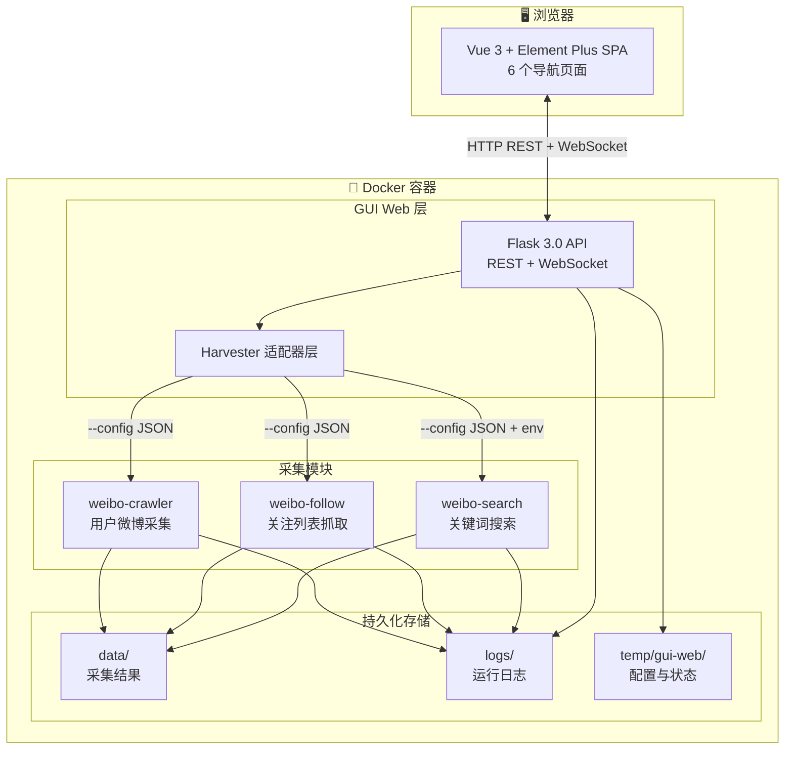
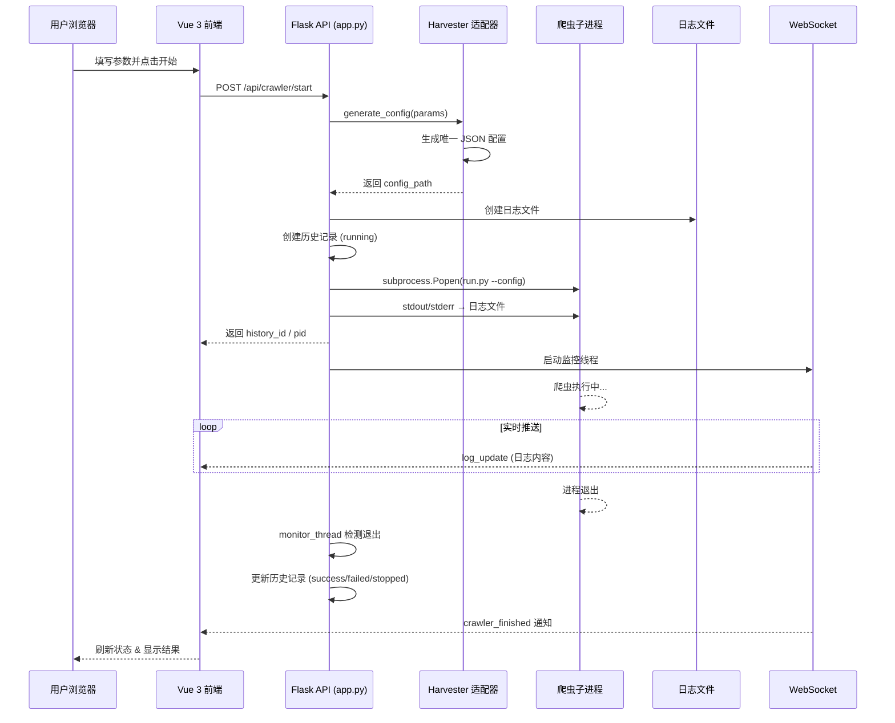

# WeiboHarvester

> 版本：`1.3` | 基于 [dataabc/weibo](https://github.com/dataabc/weibo) 系列工具改造整合

一个基于 Docker 的一体化微博数据采集平台，整合了 **3 个微博采集模块**（用户微博采集、关注列表抓取、关键词搜索），并通过**统一的 Web GUI** 进行任务管理、参数配置、历史回溯和实时日志查看。全平台采用**配置驱动运行**模式——GUI 为每次任务生成唯一 JSON 配置文件，通过 `--config <path>` 协议传给对应采集模块执行。

---

## 目录

- [功能特性](#功能特性)
- [架构概览](#架构概览)
- [快速启动](#快速启动)
- [GUI 使用指南](#gui-使用指南)
- [爬虫模块说明](#爬虫模块说明)
- [配置说明](#配置说明)
- [API 接口说明](#api-接口说明)
- [目录结构](#目录结构)
- [开发指南](#开发指南)
- [部署到其他电脑](#部署到其他电脑)
- [相关文档](#相关文档)
- [常见问题](#常见问题)

---

## 功能特性

| 功能 | 说明 |
|------|------|
| **统一 Web GUI** | Flask 3.0 + Flask-SocketIO + Vue 3.4 + Element Plus 2.3，6 个导航页管理所有任务 |
| **3 大采集模块** | 用户微博采集（weibo-crawler）/ 关注列表抓取（weibo-follow）/ 关键词搜索（weibo-search） |
| **实时日志推送** | WebSocket（SocketIO）实时推送爬虫运行日志到浏览器，无需 SSH 进容器 |
| **任务持久化** | 每次运行自动生成唯一配置快照，状态/耗时/退出码/失败原因/日志路径完整记录 |
| **历史回溯** | 可从历史记录一键复用参数（复用配置），历史/日志/配置文件联动清理 |
| **Cookie 管理** | 全局 Cookie 统一配置，所有模块共享，支持格式校验 |
| **Docker 一体化** | 一个镜像、一条命令，开发和生产环境一致；支持热更新挂载 |
| **配置驱动运行** | 每次任务生成唯一配置文件到 `temp/gui-web/runtime-configs/`，不污染源码 |
| **多种输出格式** | CSV / JSON / Markdown / SQLite / MySQL / MongoDB / TXT（模块支持情况不同） |
| **反封禁策略** | 请求随机延迟、会话限制、批次暂停、睡眠休息等策略可配置 |

---

## 架构概览

### 整体架构

```
┌──────────────────────────────────────────────────────────────┐
│               浏览器 (http://localhost:5100)                   │
│                       ▲                                       │
│         HTTP REST API │ WebSocket (SocketIO)                  │
│  ┌────────────────────┴───────────────────────────────────┐  │
│  │          GUI Web (Flask 3.0 + SocketIO)                │  │
│  │  • 参数表单（3 个爬虫模块各自的完整配置）                 │  │
│  │  • 任务启动/停止（优雅退出：SIGTERM → SIGKILL）         │  │
│  │  • 历史记录（筛选/分页/复用/删除）                       │  │
│  │  • 日志管理（实时推送/查看/清空/删除）                   │  │
│  │  • 全局设置（Cookie/时区/MySQL/MongoDB/SQLite）         │  │
│  │  • Cookie 格式校验 / MySQL/MongoDB/SQLite 连接测试       │  │
│  └──────────────────┬──────────────────────────────────────┘  │
│                     │ --config runtime-config.json             │
│  ┌──────────────────┼──────────────────────────────────────┐  │
│  │  weibo-crawler   │  weibo-follow    │  weibo-search     │  │
│  │  (原生脚本)       │  (原生脚本)       │  (Scrapy 框架)    │  │
│  └──────────────────┴──────────────────┴───────────────────┘  │
└──────────────────────────────────────────────────────────────┘
        ▲                          ▲                  ▲
        │ volumes                  │ volumes          │ volumes
┌───────┴──────────┐  ┌────────────┴───────┐  ┌──────┴──────────────┐
│ ./data/           │  │ ./logs/            │  │ ./temp/gui-web/     │
│ (采集结果输出)     │  │ (运行日志)          │  │ settings.json       │
│ • weibo-crawler/  │  │ • gui-web/         │  │ status.json         │
│ • weibo-follow/   │  │ • weibo-crawler/   │  │ history.json        │
│ • weibo-search/   │  │ • weibo-follow/    │  │ runtime-configs/    │
│ • sqlite/         │  │ • weibo-search/    │  │  (每次任务配置快照)   │
│ • mysql/          │  │                    │  │                     │
│ • mongo/          │  │                    │  │                     │
└───────────────────┘  └────────────────────┘  └─────────────────────┘
```



---

### 数据流

```
用户填参数 → GUI 生成唯一 JSON 配置 → 保存到 runtime-configs/
→ subprocess.Popen 启动爬虫进程（stdout/stderr → 日志文件）
→ monitor_thread 监控进程退出 → 更新历史记录（成功/失败/停止）
→ SocketIO 推送 crawler_finished 事件 → 前端刷新
```



---

## 快速启动

### 前置条件

- Docker Desktop 或 Docker Engine
- 确保所需端口未被占用（默认 `5100`，如冲突可在 `.env` 中修改 `FLASK_PORT`）

### 方式一：直接使用已有镜像（推荐）

```bash
# 1. 配置环境变量（首次）
cp .env.example .env
# 编辑 .env，设置 FLASK_SECRET_KEY（如使用 MySQL 还需设置 MYSQL_PASSWORD）

# 2. 导入镜像（首次）
docker load -i weiboharvester-1.3.tar

# 3. 启动容器（按需选择数据库）
# 仅爬虫（CSV/JSON/Markdown/SQLite 输出不受影响）
docker compose -f docker-compose.prod.yml up -d
# 含 MySQL
docker compose -f docker-compose.prod.yml --profile mysql up -d
# 含 MongoDB
docker compose -f docker-compose.prod.yml --profile mongo up -d
# 含 MySQL + MongoDB（等同于旧版全部启动）
docker compose -f docker-compose.prod.yml --profile db up -d

# 4. 访问 GUI
open http://localhost:5100
```

### 方式二：从源码构建

```bash
# 1. 配置环境变量（首次）
cp .env.example .env
# 编辑 .env，设置 FLASK_SECRET_KEY（如使用 MySQL 还需设置 MYSQL_PASSWORD）

# 2. 构建镜像
docker build -t weiboharvester:1.3 .

# 3. 启动（开发模式，含代码热更新）
# 同上，按需选择 --profile mysql / --profile mongo / --profile db
docker compose up -d

# 4. 访问 GUI
open http://localhost:5100
```

### 常用命令

```bash
# 查看运行日志
docker compose logs -f

# 停止服务
docker compose down

# 重启服务
docker compose restart

# 进入容器（调试用）
docker exec -it weibo-harvester bash

# 单独启动/停止 MySQL
docker compose --profile mysql up -d mysql
docker compose --profile mysql stop mysql

# 单独启动/停止 MongoDB
docker compose --profile mongo up -d mongo
docker compose --profile mongo stop mongo
```

---

## GUI 使用指南

访问 `http://localhost:5100` 后，顶部导航提供 **6 个页面**：

### 页面总览

| 页面 | 功能 |
|------|------|
| **主页** | 功能导航卡片 + 历史记录表格（筛选/翻页/复用参数/查看日志/删除） |
| **微博爬虫** | weibo-crawler 完整参数表单，分区配置 |
| **关注列表** | weibo-follow 参数表单，用户 ID 列表输入 |
| **关键词搜索** | weibo-search 参数表单，关键词/日期/区域/类型 |
| **日志管理** | 所有模块日志文件列表，查看/清空/删除 |
| **全局设置** | Cookie / 时区 / MySQL / MongoDB / SQLite / 日志配置，支持 Cookie 验证 & 三数据库连接测试 |

### 1. 微博爬虫（weibo-crawler）

最完整的模块，支持丰富的采集参数（7 个配置分区）：

| 分区 | 主要参数 | 说明 |
|------|----------|------|
| 基本爬取 | `user_id_list`、`since_date`、`end_date`、`start_page` | 目标用户、时间范围、起始页 |
| 内容过滤 | `only_crawl_original`（仅原创）、`query_list`（按关键词过滤） | 可选的内容筛选 |
| 输出配置 | `write_mode`（csv/json/markdown/sqlite/mysql/mongodb）、`output_directory` | 6 种输出格式可多选 |
| 图片/视频 | 原帖/转发 图片/视频/LivePhoto 下载开关（6 个开关） | 含 EXIF 写入和文件时间修改 |
| 评论/转发 | `download_comment`、`download_repost`、`comment_max_download_count`、`repost_max_download_count`、`comment_pic_download` | 下载评论/转发及其中图片 |
| 数据库 | `sqlite_db_path`、`mongodb_URI`、`mysql_config`（host/port/user/password） | 各数据库连接配置 |
| 反封禁 | `enabled`、`max_weibo_per_session`、`batch_size`、`batch_delay`、`request_delay_min/max`、`max_session_time`、`max_api_errors`、`rest_time_min`、`random_rest_probability` | 9 项反封禁策略 |

### 2. 关注列表（weibo-follow）

批量获取指定用户的关注列表，输出带时戳的 `user_id_list.txt` 文件，同时支持写入 SQLite / MySQL / MongoDB：

| 参数 | 说明 |
|------|------|
| `user_id_list` | 目标用户 ID 列表（一行一个），支持注释行 |
| `use_sqlite` / `use_mysql` / `use_mongo` | 数据库输出开关 |
| 输出 | 自动生成 `{首个user_id}_{时间戳}_user_id_list.txt` 到 `/app/data/weibo-follow/` |

技术实现：通过子类覆写（`HarvesterFollow`）扩展原始 `Follow` 类，不修改原始文件，通过 `weibo.cn` WAP 页面逐页爬取，内置随机暂停防封。

### 3. 关键词搜索（weibo-search）

基于 Scrapy 框架的关键词搜索抓取，支持丰富的过滤条件：

| 参数 | 说明 | 默认值 |
|------|------|--------|
| `keyword` | 搜索关键词 | 必填 |
| `start_time` / `end_time` | 时间范围 | 当天 |
| `search_type` | 微博类型：1=原创 0=全部 2=热门 3=关注 4=认证用户 5=媒体 6=观点 | `1` |
| `filter_type` | 包含类型：0=全部 1=图片 2=视频 3=音乐 4=链接 | `0` |
| `region` | 地区筛选，支持逗号分隔多地区（如"北京,上海"） | `全部` |
| `further_threshold` | 搜索结果拆分阈值，超过该数量自动按天/小时/地区细化 | `46` |
| `limit_result` | 结果数量限制，0=不限制 | `0` |
| `max_pages` | 最大翻页数 | `100` |
| `wait_time` | 请求延迟（秒） | `5` |
| `images_store` / `files_store` | 图片/文件存储路径 | `/app/data/weibo-search/images/` |
| 输出格式 | `use_csv`、`use_mysql`、`use_mongo`、`use_sqlite`、`use_images`、`use_videos` | 可多选 |

### 任务管理

- **启动任务**：填写参数后点击「开始」，GUI 生成唯一配置文件到 `runtime-configs/` 并启动爬虫子进程
- **停止任务**：点击「停止」，GUI 先发送 SIGTERM 信号优雅终止，10 秒超时后发送 SIGKILL 强制终止；历史记录标记 `stop_requested` 状态
- **查看日志**：历史记录中点击「日志」按钮，弹窗展示日志内容（终端暗色风格，最多显示 1000 行）
- **复用参数**：历史记录中点击「复用」按钮，自动回填该次运行的所有参数
- **查看历史**：每次运行的参数快照、状态、耗时、退出码、失败原因均持久化保存
- **实时监控**：启动任务后状态栏实时显示运行状态，任务结束通过 WebSocket 自动推送通知

---

## 爬虫模块说明

### weibo-crawler（用户微博采集）

最核心也最完整的模块（主文件 `weibo.py` 3584 行），按用户 ID 逐页抓取微博内容。

**采集能力：**
- 支持爬取全部微博 / 仅原创 / 按关键词（`query_list`）过滤
- 支持下载原帖和转发中的图片、视频、LivePhoto 视频
- 支持下载评论（一级）和转发内容，含评论中的图片
- 支持增量采集：可设置定时任务（`__main__.py` + `schedule` 库）自动更新

**输出格式：**
| 格式 | 说明 |
|------|------|
| CSV | 默认输出，含用户信息 + 微博信息（30+ 字段） |
| JSON | 结构化输出 |
| Markdown | 按 `day_by_month` 或 `day_by_day` 拆分 |
| SQLite | 单文件数据库，可选 `store_binary_in_sqlite` |
| MySQL | 通过 PyMySQL 写入 |
| MongoDB | 通过 PyMongo 写入 |

**技术实现：**
- 通过导入 `Weibo` 类绕过原始 `main()`，`weibo.py` 零修改
- 使用 `requests` + `lxml` 解析微博页面
- Cookie 通过环境变量 `WEIBO_COOKIE` 安全注入，不落磁盘
- 反封禁策略：请求随机延迟、每会话微博数上限、批次暂停、会话休息、API 错误累计退出、随机概率休息
- 图片下载使用 `piexif` 写入 EXIF 时间信息
- 支持头像下载（`_download_avatar`，从 users.csv 匹配用户头像 URL）
- 通知：支持 PushDeer 推送完成/异常报警
- 工具模块：`util/csvutil.py`（CSV 读写）、`util/dateutil.py`（日期处理）、`util/llm_analyzer.py`（LLM 内容分析）、`util/notify.py`（推送通知）
- 原始文档：`weibo-crawler/README.md`

### weibo-follow（关注列表抓取）

批量获取指定用户的关注列表（含昵称和 user_id），输出可直接作为 weibo-crawler 的输入。

**技术实现：**
- 通过子类 `HarvesterFollow` 继承原始 `Follow` 类，覆写 `write_to_txt()` 和 `start()` 方法，原始文件零修改
- 通过 `weibo.cn` WAP 旧版页面逐页爬取（无 API 限制）
- 单用户最多获取 200 个关注
- 内置随机暂停机制（每 1-5 页随机 sleep 6-10 秒）
- 输出格式：`{首个user_id}_{时间戳}_user_id_list.txt`，每行格式 `user_id nickname`
- 支持三数据库输出：SQLite（WAL 模式 + 自动建表）、MySQL（ON DUPLICATE KEY UPDATE 幂等写入）、MongoDB（upsert 幂等写入）
- 带完整数据库生命周期管理（init → write → close）
- Cookie 通过环境变量 `WEIBO_COOKIE` 安全注入，不落磁盘
- 原始文档：`weibo-follow/README.md`

**链式扩展：** 关注列表的 user_id 可再作为输入 → 理论上可扩展到 200×200=40000 乃至更大量级。

### weibo-search（关键词搜索）

基于 Scrapy 2.5 框架的关键词搜索抓取，是三个模块中架构最规范的。

**技术架构：**
- Spider: `search.py`（637 行）—— 核心爬虫逻辑
- Items: `items.py` — 微博数据模型，定义 21 个字段（id、正文、转发/评论/点赞数、图片列表、视频 URL、VIP 信息、IP 属地等）
- Pipelines: `pipelines.py` — 数据处理管道链：去重 → CSV → SQLite → MySQL → MongoDB → 图片下载 → 视频下载（所有 Pipeline 含 None 安全检查）
- Settings: `settings.py` — 从 JSON 配置文件动态加载参数 + Cookie 环境变量 `WEIBO_COOKIE` fallback
- Utils: `region.py`（全国省市编码映射 ~600 行）+ `util.py`（类型转换、日期标准化）

**智能搜索策略：**
- 搜索结果超过 `further_threshold`（默认 46 条）时，自动按天拆分搜索
- 单天结果仍超阈值时，自动按小时拆分
- 小时结果仍超阈值时，自动按省/直辖市拆分
- 省市结果仍超阈值时，自动按城市拆分
- 最大化避免搜索结果被微博服务器截断

**入口：** `run.py`（程序入口，支持 `--config` 参数 + Cookie注入 + os.chdir 输出路径管理）→ `settings.py`（读取配置）→ `search.py`（Spider）→ Pipelines（数据处理）

> 以上三个模块均已适配 `--config <path>` 启动协议，由 GUI 统一调度。GUI 为每次运行生成唯一 JSON 配置文件传入，不建议在容器内直接运行模块。

---

## 配置说明

### .env 文件配置（推荐方式）

所有敏感配置（密码、密钥、Cookie）通过项目根目录的 `.env` 文件管理：

```bash
# 1. 首次使用：复制模板文件
cp .env.example .env

# 2. 编辑 .env，至少设置以下变量：
#    FLASK_SECRET_KEY  — Flask 会话签名密钥（生产环境建议固定值，避免重启后 session 丢失）
#    MYSQL_PASSWORD    — MySQL 数据库密码（如使用 MySQL 则必填）
#    API_TOKEN         — API 访问令牌（公网部署建议启用）
```

`.env` 文件已加入 `.gitignore`，不会被提交到版本控制系统。

### 环境变量完整列表

| 变量 | 默认值 | 说明 |
|------|--------|------|
| `FLASK_SECRET_KEY` | 自动生成 | Flask 会话签名密钥，生产环境建议固定值（重启后 session 不失联） |
| `API_TOKEN` | 空（不启用认证） | API 访问令牌，设为非空值启用认证 |
| `FLASK_ENV` | `production` | Flask 环境（development/production） |
| `FLASK_PORT` | `5100` | GUI 服务端口 |
| `FLASK_DEBUG` | `0` | Flask 调试模式 |
| `PYTHONUNBUFFERED` | `1` | Python 无缓冲输出（确保日志实时写入） |
| `MYSQL_HOST` | `weibo-mysql` | MySQL 主机 |
| `MYSQL_PORT` | `3306` | MySQL 端口 |
| `MYSQL_USER` | `root` | MySQL 用户 |
| `MYSQL_PASSWORD` | 空 | MySQL 密码（如使用 MySQL 则需设置） |
| `MYSQL_DATABASE` | `weibo_crawler` | MySQL 数据库名 |
| `MONGODB_URI` | `mongodb://weibo-mongo:27017/` | MongoDB 连接 URI |
| `LOG_LEVEL` | `INFO` | 日志级别 |
| `TZ` | `Asia/Shanghai` | 时区 |
| `MAX_CRAWLER_RUNTIME` | `86400` | 爬虫最大运行时间（秒） |

**反封禁策略默认值（环境变量）：**

| 变量 | 默认值 | 说明 |
|------|--------|------|
| `ANTI_BAN_ENABLED` | `true` | 启用反封禁 |
| `MAX_WEIBO_PER_SESSION` | `500` | 每会话最大微博数 |
| `BATCH_SIZE` | `50` | 批次大小 |
| `BATCH_DELAY` | `30` | 批次间暂停（秒） |
| `REQUEST_DELAY_MIN` | `8` | 请求最小延迟（秒） |
| `REQUEST_DELAY_MAX` | `15` | 请求最大延迟（秒） |
| `MAX_SESSION_TIME` | `600` | 最大会话时间（秒） |
| `MAX_API_ERRORS` | `5` | 最大 API 错误次数 |
| `REST_TIME_MIN` | `180` | 休息时间（秒） |

### GUI 设置（持久化到 `temp/gui-web/settings.json`）

通过全局设置页面配置，支持：

| 设置项 | 说明 |
|--------|------|
| **Cookie** | 全局微博 Cookie，所有模块共享，支持在线验证（实际请求微博 API 检测） |
| **时区** | 默认 `Asia/Shanghai`，影响日志/文件名时间戳 |
| **MySQL 配置** | host / port / user / password / charset，支持连接测试 |
| **MongoDB 配置** | URI 连接串，支持连接测试 |
| **SQLite 配置** | 数据库文件路径，支持路径可用性测试 |
| **日志配置** | 保留行数、文件大小限制、备份数 |

### 运行时目录（容器内）

| 路径 | 说明 | 宿主机挂载 |
|------|------|-----------|
| `/app/data/weibo-crawler/` | 用户微博采集输出 | `./data/weibo-crawler/` |
| `/app/data/weibo-follow/` | 关注列表输出 | `./data/weibo-follow/` |
| `/app/data/weibo-search/` | 搜索结果输出 | `./data/weibo-search/` |
| `/app/data/sqlite/` | SQLite 数据库文件 | `./data/sqlite/` |
| `/app/logs/gui-web/` | GUI 自身日志 | `./logs/gui-web/` |
| `/app/logs/weibo-crawler/` | 采集模块日志 | `./logs/weibo-crawler/` |
| `/app/logs/weibo-follow/` | 关注模块日志 | `./logs/weibo-follow/` |
| `/app/logs/weibo-search/` | 搜索模块日志 | `./logs/weibo-search/` |
| `/app/temp/gui-web/` | GUI 临时文件目录 | `./temp/gui-web/` |
| `/app/temp/gui-web/runtime-configs/` | 每次运行的配置快照 | `./temp/gui-web/runtime-configs/` |

---

## API 接口说明

GUI 后端提供完整的 REST API，供前端调用：

### 设置管理

| 方法 | 路由 | 说明 |
|------|------|------|
| `GET` | `/api/settings` | 获取全局设置 |
| `POST` | `/api/settings` | 保存全局设置 |

### 状态管理

| 方法 | 路由 | 说明 |
|------|------|------|
| `GET` | `/api/status` | 获取当前运行状态（含 running_crawler、pid、history_id） |

### 爬虫任务

| 方法 | 路由 | 说明 |
|------|------|------|
| `POST` | `/api/crawler/start` | 启动爬虫（body: `{crawler_type, params}`）→ 返回 history_id, pid, log_filename |
| `POST` | `/api/crawler/stop` | 停止当前运行爬虫 |
| `POST` | `/api/start` | 启动爬虫（兼容旧路由别名） |
| `POST` | `/api/stop` | 停止爬虫（兼容旧路由别名） |
| `GET` | `/api/last-params/<crawler_name>` | 获取指定爬虫最近一次运行参数（供复用） |

### 历史记录

| 方法 | 路由 | 说明 |
|------|------|------|
| `GET` | `/api/history` | 获取全部历史记录（按时间倒序，含 `time_display`、`summary`、`has_log` 等计算字段） |
| `DELETE` | `/api/history` | 清空全部历史（联动清理配置文件，运行中任务拒绝清空） |
| `DELETE` | `/api/history/<record_id>` | 删除单条历史（联动删除配置文件） |
| `GET` | `/api/history/<record_id>/params` | 获取单条历史关联的配置参数快照 |
| `POST` | `/api/history/keep_recent` | 保留最近 N 条（body: `{n}`），清理其余 |

### 日志管理

| 方法 | 路由 | 说明 |
|------|------|------|
| `GET` | `/api/logs` | 获取所有日志文件列表（含大小、修改时间） |
| `DELETE` | `/api/logs` | 清空全部日志 |
| `GET` | `/api/logs/file/<filename>` | 按文件名读取日志内容（`?lines=100`） |
| `DELETE` | `/api/logs/delete` | 按文件名删除日志（body: `{filename}`） |
| `GET` | `/api/logs/<crawler_type>` | 获取指定类型爬虫最新日志（兼容旧接口） |
| `POST/DELETE` | `/api/logs/<crawler_type>/clear` | 清空指定类型爬虫日志 |

### 工具接口

| 方法 | 路由 | 说明 |
|------|------|------|
| `POST` | `/api/cookie/verify` | 验证 Cookie 有效性（实际请求微博 API 检测登录状态） |
| `POST` | `/api/mysql/test` | 测试 MySQL 连接（5 秒超时） |
| `POST` | `/api/mongo/test` | 测试 MongoDB 连接（5 秒超时 ping） |
| `POST` | `/api/sqlite/test` | 测试 SQLite 路径可用性（验证读写权限） |

### WebSocket 事件

| 事件 | 方向 | 说明 |
|------|------|------|
| `connect` | 客户端→服务端 | 建立连接，服务端回复 `connected` |
| `subscribe_log` | 客户端→服务端 | 订阅指定爬虫日志（`{crawler_type}`），每秒推送 |
| `log_update` | 服务端→客户端 | 日志内容实时推送（`{crawler_type, content}`） |
| `crawler_finished` | 服务端→客户端 | 爬虫任务完成通知（`{crawler_type, status, history_id, exit_code, failure_reason}`） |

---

## 目录结构

```
WeiboHarvester/
├── Dockerfile                   # 镜像定义（Python 3.11-slim，合并依赖安装）
├── docker-compose.yml           # 开发模式（含代码热更新 volumes 挂载）
├── docker-compose.prod.yml      # 生产模式（仅挂载 data/logs/temp，代码在镜像内）
├── requirements-all.txt         # 全模块依赖汇总（requests/PyMySQL/scrapy 等 10+ 包）
├── start.py                     # 容器内辅助菜单（可命令行交互操作）
├── menu.sh                      # Shell 入口（委托给 start.py）
├── .dockerignore                # 构建上下文排除规则
├── .gitignore                   # Git 版本控制排除规则
│
├── gui-web/                     # ← Web 管理界面（项目主入口）
│   ├── app.py                   # Flask 3.0 后端（940 行，含 SocketIO/CORS/API 路由/进程监控/API认证/优雅关闭）
│   ├── config.py                # 路径/端口/默认配置/Crawler 命令映射（228 行）
│   ├── utils.py                 # 工具函数（817 行：设置/状态/历史/日志/配置文件管理/原子写入）
│   ├── requirements.txt         # GUI 依赖（flask/flask-socketio/flask-cors/eventlet/psutil）
│   ├── README.md                # GUI 模块内部文档
│   ├── harvesters/             # 采集配置生成适配层
│   │   ├── __init__.py
│   │   ├── weibo_crawler.py     # weibo-crawler 配置生成（120 行，含路径规范化）
│   │   ├── weibo_follow.py      # weibo-follow 配置生成（67 行，含输出文件名生成）
│   │   └── weibo_search.py      # weibo-search 配置生成（113 行，含路径规范化）
│   ├── static/                  # 前端静态资源（本地化部署，不依赖 CDN）
│   │   ├── css/
│   │   │   └── style.css        # 全局样式（298 行，含暗色终端日志风格）
│   │   ├── js/
│   │   │   ├── app.js           # Vue 3 应用逻辑（1281 行，6 个页面/状态管理/重试机制）
│   │   │   ├── vue@3.4.21.global.prod.js     # Vue 3 生产构建
│   │   │   ├── axios@1.6.8.browser.axios.min.js  # HTTP 客户端
│   │   │   └── element-plusiconsvue@2.3.1...js  # Element Plus 图标库
│   │   └── element-plus/
│   │       ├── element-plus@2.3.14.index.css   # Element Plus 样式
│   │       └── element-plus@2.3.14.index.full.js  # Element Plus 完整组件库
│   └── templates/
│       └── index.html           # 单页面应用（749 行，Element Plus 组件 + Vue 模板）
│
├── tools/
│   └── dataabc/
│       ├── weibo-crawler/               # ← 用户微博爬虫模块
│       │   ├── weibo.py                 # 主爬虫逻辑（原始文件，零修改）
│       │   ├── run.py                   # Harvester 包装入口（--config 参数 + Cookie环境变量注入 + 头像下载 + PushDeer通知）
│       │   ├── __main__.py              # 定时任务入口（schedule 库）
│       │   ├── const.py                 # 常量定义
│       │   ├── logging.conf             # 日志配置（日志路径适配容器）
│       │   ├── requirements.txt         # 模块依赖
│       │   ├── README.md                # 原始上游文档
│       │   └── util/
│       │       ├── csvutil.py           # CSV 读写工具
│       │       ├── dateutil.py          # 日期处理
│       │       ├── llm_analyzer.py      # LLM 内容分析（可选功能）
│       │       └── notify.py            # PushDeer 异常推送通知
│       │
│       ├── weibo-follow/                # ← 关注列表爬虫模块
│       │   ├── weibo_follow.py          # 主爬虫逻辑（原始文件，零修改）
│       │   ├── run.py                   # Harvester 包装入口（子类覆写 + Cookie注入 + 三数据库写入）
│       │   ├── requirements.txt         # 模块依赖
│       │   └── README.md                # 原始上游文档
│       │
│       └── weibo-search/                # ← 关键词搜索爬虫模块（Scrapy 项目）
│           ├── scrapy.cfg               # Scrapy 项目配置
│           ├── run.py                   # 程序入口（--config 参数 + Cookie注入 + os.chdir 输出路径管理）
│           ├── requirements.txt         # 模块依赖
│           ├── README.md                # 原始上游文档
│           └── weibo/
│               ├── items.py             # 微博数据模型（21 个字段）
│               ├── pipelines.py         # 数据处理管道（去重/CSV/SQLite/MySQL/MongoDB/图片视频 + None安全检查）
│               ├── settings.py          # Scrapy 设置（从 JSON 配置动态加载 + Cookie环境变量fallback）
│               ├── middlewares.py       # 中间件（模板）
│               ├── spiders/
│               │   ├── __init__.py
│               │   └── search.py        # 搜索 Spider（637 行，智能拆分策略）
│               └── utils/
│                   ├── __init__.py
│                   ├── region.py        # 全国省市编码映射（~600 行）
│                   └── util.py          # 工具函数（类型转换/日期标准化）
│
├── data/                        # ← 运行时数据输出（git 忽略，宿主机挂载）
│   ├── weibo-crawler/
│   ├── weibo-follow/
│   └── weibo-search/
│
├── logs/                        # ← 运行时日志（git 忽略，宿主机挂载）
│   ├── gui-web/
│   ├── weibo-crawler/
│   ├── weibo-follow/
│   └── weibo-search/
│
├── temp/                        # ← GUI 临时文件（git 忽略，宿主机挂载）
│   └── gui-web/
│       ├── settings.json        # 全局设置（Cookie/时区/MySQL/日志配置）
│       ├── status.json          # 运行状态（running_crawler/pid/history_id）
│       ├── history.json         # 任务历史（每次运行完整记录）
│       └── runtime-configs/     # 每次任务生成的唯一配置快照
│           ├── weibo-crawler/
│           ├── weibo-follow/
│           └── weibo-search/
│
└── dist/                        # ← 发布包（版本 1.3）
    ├── weiboharvester-1.3.tar   # Docker 镜像文件
    ├── docker-compose.prod.yml         # 生产部署配置
    └── USAGE.md                        # 部署使用说明
```

---

## 开发指南

### 技术栈

| 层级 | 技术 | 版本 |
|------|------|------|
| **运行环境** | Python + Docker | Python 3.11-slim |
| **后端框架** | Flask + Flask-SocketIO + Flask-CORS | 3.0.3 / 5.3.6 / 4.0.0 |
| **WebSocket** | eventlet (threading 模式) | 0.36.1 |
| **前端框架** | Vue 3 + Element Plus | 3.4.21 / 2.3.14 |
| **HTTP 客户端** | Axios | 1.6.8 |
| **爬虫框架** | Scrapy（仅 weibo-search） | 2.5+ |
| **页面解析** | requests + lxml | 2.33+ / 4.9+ |
| **数据库驱动** | PyMySQL / PyMongo | 1.1.1 / 4.6.3 |
| **进度条** | tqdm | 4.66+ |
| **进程管理** | psutil | 5.9.8 |
| **图片处理** | Pillow / piexif | 8.1+ / 1.1+ |

### 核心依赖（requirements-all.txt）

```
requests>=2.33.0           # HTTP 请求（全模块共用）
lxml==4.9.1                # HTML 解析（crawler + follow）
PyMySQL==1.1.1             # MySQL 驱动
pymongo==4.6.3             # MongoDB 驱动
Flask==3.1.3               # Web 框架
tqdm>=4.66.0               # 进度条
schedule==1.2.1             # 定时任务（crawler 定时模式）
Pillow>=8.1.1              # 图片处理（search）
scrapy>=2.5.0              # 爬虫框架（search）
json5>=0.9.25              # JSON5 解析
piexif~=1.1.3              # EXIF 写入
python-dotenv>=1.0.0       # 环境变量加载
cryptography>=41.0.0       # MySQL 8.0 认证
pytz>=2024.1               # 时区处理
```

GUI 额外依赖（`gui-web/requirements.txt`）：
```
flask==3.0.3
flask-socketio==5.3.6
flask-cors==4.0.0
eventlet==0.36.1
psutil==5.9.8
```

### 开发模式启动

```bash
docker compose up -d
```

开发模式通过 `docker-compose.yml` 中的 `volumes` 挂载了全部代码目录（tools/dataabc/weibo-crawler / tools/dataabc/weibo-follow / tools/dataabc/weibo-search / gui-web），修改宿主机上的 `.py` / `.js` / `.html` / `.css` 文件后会自动同步到容器内，**无需每次重新 build 镜像**。

### 添加新功能

1. **新增爬虫参数**：
   - 在 `gui-web/config.py` 的 `DEFAULT_SETTINGS["crawler_defaults"][<module>]` 中添加默认值
   - 在 `gui-web/templates/index.html` 中添加表单控件（`v-model` 绑定需加模块前缀）
   - 在对应 `gui-web/harvesters/<module>.py` 的 `generate_config()` 中处理新参数
   - 在 `gui-web/static/js/app.js` 中确保 `serializeParams()` 正确序列化

2. **前端命名规范**：
   - `reactive` 对象的键名必须加模块前缀：`crawler-xxx`、`follow-xxx`、`search-xxx`
   - 序列化发送给后端时，使用 `serializeParams()` 去掉前缀还原为原始参数名
   - Element Plus 组件必须使用显式闭合标签（浏览器原生不支持自闭合）

3. **后端接口规范**：
   - 配置文件通过 `save_runtime_config()` 生成到 `runtime-configs/` 目录
   - 所有临时文件使用 `utils.py` 中的管理函数，确保路径一致性
   - 时区处理统一使用 `utils.py` 中的 `now_local()` / `to_local_time()` / `get_timezone()`

### Jinja2 与 Vue 冲突解决

`app.py` 中修改了 Jinja2 模板定界符，避免与 Vue 的 `{{ }}` 冲突：

```python
app.jinja_env.variable_start_string = ''
```

### 构建新版本镜像

```bash
# 1. 构建（版本号递增）
docker build -t weiboharvester:X.Y .

# 2. 导出镜像
docker save -o dist/weiboharvester-X.Y.tar weiboharvester:X.Y

# 3. 更新 docker-compose.yml 和 docker-compose.prod.yml 中的镜像标签
# 4. 重建并启动
docker compose up -d --force-recreate
```

---

## 部署到其他电脑

### 方式一：使用发布包（推荐）

`dist/` 目录下提供发布包，包含：

| 文件 | 说明 |
|------|------|
| `weiboharvester-1.3.tar` | Docker 镜像文件（`docker save` 导出） |
| `docker-compose.prod.yml` | 生产版 Compose 配置（不挂载代码，仅数据目录） |
| `USAGE.md` | 详细部署使用说明 |

在另一台电脑上：

```bash
# 1. 将 dist/ 目录复制到目标电脑
# 2. 导入镜像
docker load -i weiboharvester-1.3.tar

# 3. 启动（生产模式）
docker compose -f docker-compose.prod.yml up -d

# 4. 访问
open http://localhost:5100
```

**生产模式说明：**
- 生产模式（`docker-compose.prod.yml`）只挂载 `data/`、`logs/`、`temp/` 三个运行时目录
- 代码已在镜像内，不会随宿主机文件变化
- 使用独立 `bridge` 网络，不依赖外部预建网络，可独立运行

### 方式二：Docker Hub（适合频繁分发）

```bash
# 在当前电脑推送
docker tag weiboharvester:1.3 <your-dockerhub-username>/weiboharvester:1.3
docker push <your-dockerhub-username>/weiboharvester:1.3

# 在另一台电脑拉取并运行
docker pull <your-dockerhub-username>/weiboharvester:1.3
docker run -d -p ${FLASK_PORT:-5100}:${FLASK_PORT:-5100} \
  -v $(pwd)/data:/app/data \
  -v $(pwd)/logs:/app/logs \
  -v $(pwd)/temp:/app/temp \
  --name weibo-harvester \
  <your-dockerhub-username>/weiboharvester:1.3
```

### 方式三：直接用 docker run（无需 Compose）

```bash
docker run -d \
  -p ${FLASK_PORT:-5100}:${FLASK_PORT:-5100} \
  -v $(pwd)/data:/app/data \
  -v $(pwd)/logs:/app/logs \
  -v $(pwd)/temp:/app/temp \
  --name weibo-harvester \
  --restart unless-stopped \
  weiboharvester:1.3
```

---

## 相关文档

`document/` 目录下提供四份面向不同目标的文档：

| 文档 | 目标读者 | 内容 |
|------|----------|------|
| **README.md**（本文） | 所有用户 | 项目总览、快速启动、完整功能参考 |
| **USAGE.md** | 最终用户 | 部署指南、GUI 操作教程、常见任务示例 |
| **COMPARISON_REPORT.md** | 开发/贡献者 | 对原始 dataabc 工具的逐文件修改比对、设计哲学 |
| **ENV_ANALYSIS_REPORT.md** | 运维/系统管理 | 完整环境变量清单、配置层次图、安全评估 |

此外：
- `gui-web/README.md` — GUI 内部设计文档（数据结构、运行机制）
- 各爬虫模块的 `README.md` — 原始上游参数说明（位于 `tools/dataabc/weibo-*/`）

---

## 常见问题

### Q：浏览器无法访问 GUI？

**排查步骤：**
1. `docker ps` 确认容器状态为 `Up`
2. `docker logs weibo-harvester` 查看是否输出 `Starting server on http://0.0.0.0:...`
3. 确认访问的端口与 `.env` 中 `FLASK_PORT`（默认 `5100`）一致：`lsof -i :<端口号>`
4. 如果端口冲突，在 `.env` 中修改 `FLASK_PORT` 后重启容器
5. 如果容器频繁退出，检查 `docker logs` 是否有 Python 异常

### Q：数据没有写入？

**排查步骤：**
1. 确认 `./data/` 目录有写权限（Docker 以 root 运行，一般不存在权限问题）
2. 检查容器内 `/app/data` 是否正常挂载：`docker exec weibo-harvester ls /app/data`
3. 查看对应模块日志（GUI → 日志管理 → 查看对应日志文件）
4. 确认 Cookie 有效：在 GUI 全局设置中使用 Cookie 验证功能

### Q：`docker build` 失败，提示镜像源连接错误？

**解决方案：**
1. 打开 Docker Desktop → Settings → Docker Engine
2. 移除 `registry-mirrors` 中的失效镜像源（如 `docker.mirrors.ustc.edu.cn`）
3. 或改为使用 `DOCKER_BUILDKIT=0 docker build ...` 绕过 BuildKit 镜像源逻辑
4. 也可先不加镜像源，等镜像 pull 完成后再加回

### Q：如何清理旧镜像释放磁盘空间？

```bash
# 查看所有项目镜像
docker images weiboharvester

# 删除指定版本
docker rmi weiboharvester:1.0

# 清理无标签的悬空镜像
docker image prune -f
```

### Q：MySQL 连接失败？

默认配置连接到容器名 `weibo-mysql`（本项目 docker-compose 自带）。

1. 如使用 MySQL：确认 `.env` 文件中 `MYSQL_PASSWORD` 已正确设置
2. 如不使用 MySQL：在 GUI 参数表单中不勾选 MySQL 相关的 `write_mode` 即可
3. 在 GUI 全局设置中修改 MySQL 连接信息（支持连接测试）

### Q：启动报错提示 MYSQL_PASSWORD 未设置？

MySQL 和 MongoDB 服务默认**不启动**（通过 Docker Compose profiles 控制）。

- **需要使用 MySQL**：在 `.env` 中设置 `MYSQL_PASSWORD=你的密码`，启动时加 `--profile mysql`
- **需要使用 MongoDB**：启动时加 `--profile mongo`
- **同时需要两者**：启动时加 `--profile db`
- **不需要外部数据库**：直接 `docker compose up -d` 即可，CSV/JSON/Markdown/SQLite 输出不受影响

### Q：如何生成安全的 FLASK_SECRET_KEY？

```bash
# 方式一：openssl
openssl rand -hex 32

# 方式二：Python
python3 -c "import secrets; print(secrets.token_hex(32))"
```

将生成的字符串填入 `.env` 文件的 `FLASK_SECRET_KEY=` 后面。

### Q：Cookie 如何获取？

1. 用 Chrome 打开 https://passport.weibo.cn/signin/login 并登录
2. 登录成功后跳转到 https://weibo.cn
3. 按 F12 → Network → 找到 weibo.cn 请求 → Headers → Request Headers
4. 复制 `Cookie:` 后的完整值
5. 在 GUI 全局设置中粘贴，点击「验证 Cookie」确认格式正确

### Q：爬虫运行中如何查看实时日志？

- GUI 首页历史记录表格中，运行中的任务会有状态标识
- 点击「日志」按钮可弹窗查看日志（每 3 秒自动刷新末 1000 行）
- 也可在「日志管理」页面查看所有模块的日志文件
- WebSocket 连接会自动推送任务完成通知

### Q：如何复用之前的爬取参数？

- 在主页历史记录中找到目标记录，点击「复用」按钮
- 系统自动读取该次运行的配置快照并回填到对应表单
- 修改参数后直接启动即可（生成新的配置快照，不会覆盖原有记录）

---

## 许可证与致谢

- 本项目的 3 个爬虫核心模块基于 [dataabc/weibo](https://github.com/dataabc/weibo) 系列开源工具改编：
  - weibo-crawler 基于 [dataabc/weibo-crawler](https://github.com/dataabc/weibo-crawler)
  - weibo-follow 基于 [dataabc/weibo-follow](https://github.com/dataabc/weibo-follow)
  - weibo-search 基于 [dataabc/weibo-search](https://github.com/dataabc/weibo-search)
- GUI 使用 Vue 3 + Element Plus + Axios + Flask-SocketIO 构建
- Docker 容器化整合、统一 GUI 管理、配置驱动运行机制由 Harvester 完成

---

*最后更新：2026-05-21*
