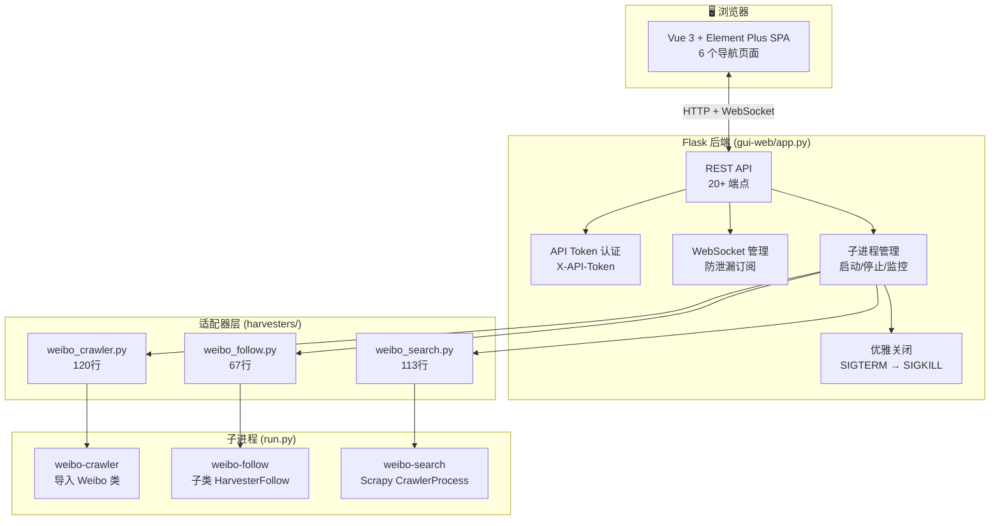
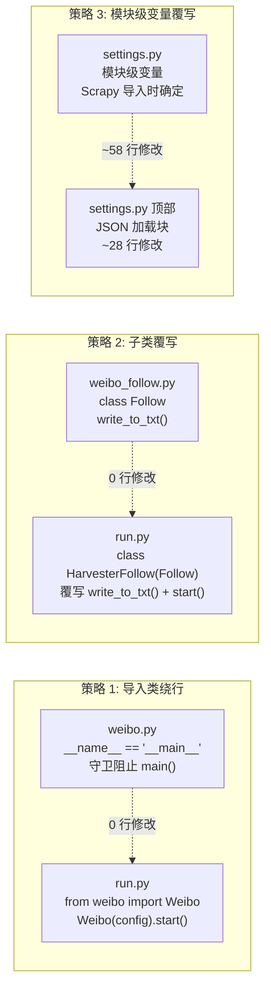
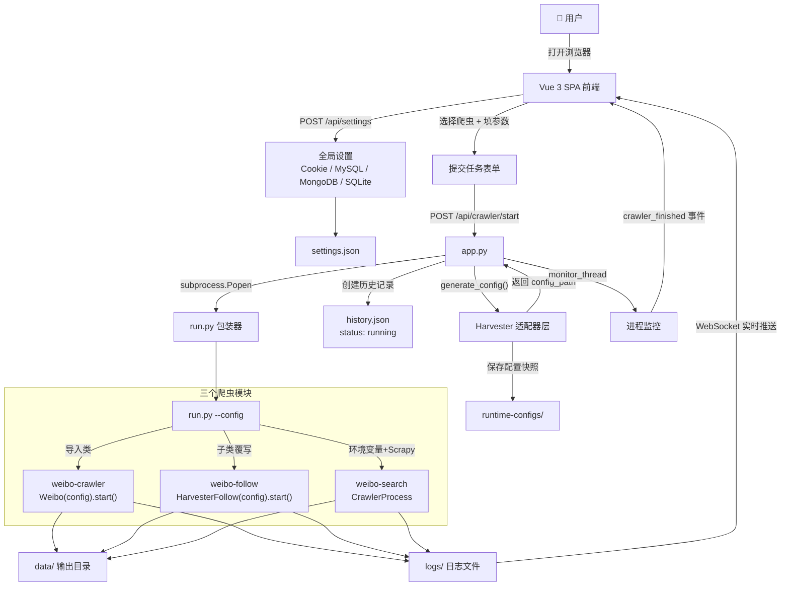

# WeiboHarvester 对原始 dataabc 爬虫工具的修改报告

> 文件级别的详细比对：本项目如何基于 dataabc 原始工具进行改造
>
> **设计哲学：对原始第三方文件的改动尽可能小（优先零修改），新增逻辑放入独立包装脚本，确保上游工具更新时能以最快方式适配。**
>
> 📖 **阅读建议**：本文面向开发/贡献者。如需项目整体介绍，请先阅读 [README.md](./README.md)。

---

## 一、概览

本项目三个爬取模块基于 `/dataabc/` 下的三个开源工具修改而来：

| 模块 | 原始来源 | 原始文件改动 | 包装方式 |
|------|----------|:---:|------|
| `weibo-crawler/` | `tools/dataabc/original/weibo-crawler-master/` | **0 行** | 导入 `Weibo` 类绕过 `main()` |
| `weibo-follow/` | `tools/dataabc/original/weibo-follow-master/` | **0 行** | 子类覆写 `write_to_txt()` + `start()` |
| `weibo-search/` | `tools/dataabc/original/weibo-search-master/` | **~28 行** (settings.py) + **~30 行** (pipelines.py) | `settings.py` 顶部加 JSON 加载块，`pipelines.py` 加 None 安全检查 |

**核心改造目标：** 使原本需要手动编辑配置文件、通过命令行直接运行的独立脚本，变为可通过 GUI 统一调度的子服务。改造后所有模块通过 `run.py --config <path>` 接收 GUI 生成的唯一 JSON 配置文件。

**第四次改造的关键改进（2026-05-21）：**
- **weibo-crawler**：`run.py` 增加 Cookie 环境变量注入、头像下载、推送通知；原始文件仍零修改
- **weibo-follow**：`run.py` 大幅扩展 — 新增 SQLite/MySQL/MongoDB 三数据库写入能力，带完整生命周期管理
- **weibo-search**：`run.py` 增加 Cookie 环境变量注入；`pipelines.py` 增加 None 安全检查（防御爬虫异常返回）；`settings.py` 增加 MongoDB 配置动态加载
- **gui-web**：全面升级 — API 认证、多爬虫并行支持、MongoDB/SQLite 测试端点、WebSocket 订阅防泄漏、原子化文件写入、时区支持、历史记录规范化

此外，新增了完整的 `gui-web/` 层（Flask + Vue 3），为三个爬虫提供统一的 Web 管理界面。

---

## 二、weibo-crawler 模块（✅ 零逻辑修改）

> 原路径：`tools/dataabc/original/weibo-crawler-master/` | 核心代码文件改动：**0 行**（仅 `logging.conf` 改 2 行日志路径适配容器部署）

### 2.1 使用文件清单

| 文件 | 状态 |
|------|------|
| `run.py` | **新增** — Harvester 包装入口（Cookie 环境变量注入 + 字段兼容 + 头像下载 + PushDeer 通知） |
| `logging.conf` | **已修改** — 日志路径改为容器路径 `/app/logs/weibo-crawler/` |
| `weibo.py` | ⚪ 完全相同 |
| `__main__.py`、`const.py` | ⚪ 完全相同 |
| `util/*` | ⚪ 完全相同 |

### 2.2 未使用文件清单

以下为原始 dataabc 仓库中的文件，本项目未使用：

| 原始文件 | 原因 |
|----------|------|
| `config.json` | 配置文件由 GUI 动态生成，不再使用静态配置 |
| `Dockerfile` | 项目使用统一的顶层 `Dockerfile` 和 `docker-compose.yml` |
| `docker-compose.yml` | 同上，项目使用顶层编排文件 |
| `.dockerignore` | 项目使用顶层忽略规则 |
| `.gitignore` | 项目使用顶层 `.gitignore` |
| `service.py` | 原始工具的独立服务模式，本项目通过 Flask GUI 替代 |
| `test_llm.py` | LLM 测试脚本，不是核心功能，本项目不引入 |
| `API.md` | 原始工具文档，不参与运行 |

### 2.3 零修改实现原理

通过 Python 的 `__name__ == '__main__'` 守卫，实现不修改原文件即可注入外部配置。

原始 `weibo.py` 末尾：
```python
def main():
    config = get_config()        # 读取本地 config.json
    wb = Weibo(config)           # 创建 Weibo 实例
    wb.start()

if __name__ == "__main__":      # ← 关键守卫
    main()
```

新 `run.py` 的做法：
```python
# run.py — 不触发原始 main()，直接操作 Weibo 类
from weibo import Weibo         # 导入类，不触发 main()

config = load_json(args.config_path)  # 从任意路径加载 JSON
wb = Weibo(config)                    # 直接注入配置
wb.start()                            # 启动爬取
```

**关键点：** `from weibo import Weibo` 执行时，`__name__` 是 `'weibo'` 而非 `'__main__'`，所以原始 `main()` 不会被调用。Harvester 包装器完全控制配置来源和启动流程。

### 2.4 run.py 包装器完整逻辑

```python
def main():
    parser = argparse.ArgumentParser()
    parser.add_argument("--config", dest="config_path")
    args = parser.parse_args()

    # 加载配置文件（支持 JSON5 注释格式）
    config_path = args.config_path or 默认本地 config.json
    config = json5.load(config_path)

    # Cookie 从环境变量注入（不落入磁盘文件）
    if 'cookie' not in config or not config['cookie']:
        cookie_from_env = os.environ.get('WEIBO_COOKIE', '')
        if cookie_from_env:
            config['cookie'] = cookie_from_env

    # 兼容旧字段名
    for old, new in [("filter", "only_crawl_original"), ...]:
        if old in config: config[new] = config.pop(old)

    wb = Weibo(config)
    wb.start()

    # 下载用户头像（需 config 中设置 avatar_download: 1）
    if config.get("avatar_download", 0):
        _download_avatar(wb)

    # PushDeer 通知
    if const.NOTIFY["NOTIFY"]:
        push_deer("更新了一次微博")
```

**新增能力：**
- `--config` argparse + JSON5 加载
- Cookie 环境变量注入（安全：不落磁盘）
- 旧字段兼容（`filter` → `only_crawl_original`）
- 头像下载（`_download_avatar`，从 `users.csv` 匹配用户头像 URL 并下载）
- PushDeer 推送通知（完成/异常通知）
- 异常捕获 + 日志记录

全部在 `run.py` 中，不触碰 `weibo.py`。

### 2.5 上游更新方式

```
cp tools/dataabc/original/weibo-crawler-master/weibo.py tools/dataabc/weibo-crawler/weibo.py
# 完成。run.py 无需任何修改。
```

---

## 三、weibo-follow 模块（✅ 零修改）

> 原路径：`tools/dataabc/original/weibo-follow-master/` | 原始文件改动：**0 行**

### 3.1 使用文件清单

| 文件 | 状态 |
|------|------|
| `weibo_follow.py` | ⚪ **原始文件，一字未改** |
| `run.py` | **新增** — Harvester 包装入口（子类覆写 + Cookie 环境变量注入 + 三数据库写入 + 数据库生命周期管理） |

### 3.2 未使用文件清单

以下为原始 dataabc 仓库中的文件，本项目未使用：

| 原始文件 | 原因 |
|----------|------|
| `config.json` | 配置文件由 GUI 动态生成，不再使用静态配置 |

### 3.3 零修改实现原理

通过 Python 子类继承 + 方法覆写，在不修改原始 `Follow` 类的情况下扩展行为。

原始 `write_to_txt()` 硬编码输出路径：
```python
# weibo_follow.py — 原始代码（不修改）
def write_to_txt(self):
    with open('user_id_list.txt', 'ab') as f:   # 硬编码到当前目录
        for user in self.follow_list:
            f.write(...)
```

`run.py` 中的子类覆写多个方法：

```python
# run.py — 子类覆写
from weibo_follow import Follow

class HarvesterFollow(Follow):
    """继承原始 Follow，扩展数据库写入能力"""

    def __init__(self, config):
        super().__init__(config)
        self._config = config
        self._sqlite_conn = None
        self._mysql_conn = None
        self._mongo_client = None

    # ---- 数据库生命周期 ----
    def _init_databases(self):
        """根据配置初始化 SQLite / MySQL / MongoDB 连接"""
        ...

    def _close_databases(self):
        """安全关闭所有数据库连接"""
        ...

    # ---- 三数据库写入 ----
    def _write_sqlite(self, entry): ...
    def _write_mysql(self, entry): ...
    def _write_mongo(self, entry): ...

    # ---- 覆写：扩展输出逻辑 ----
    def write_to_txt(self):
        """输出 TXT 文件 + 数据库（根据配置）"""
        # TXT 文件（从配置文件读取动态输出路径）
        output_filename = self._config.get('output_filename', 'user_id_list.txt')
        os.makedirs(os.path.dirname(output_filename), exist_ok=True)
        with open(output_filename, 'ab') as f:
            for user in self.follow_list:
                f.write((user['uri'] + ' ' + user['nickname'] + '\n').encode())

        # 三数据库写入
        for entry in self.follow_list:
            self._write_sqlite(entry)
            self._write_mysql(entry)
            self._write_mongo(entry)

    # ---- 覆写：带数据库生命周期管理的启动 ----
    def start(self):
        try:
            self._init_databases()
            for user_id in self.user_id_list:
                self.initialize_info(user_id)
                self.get_follow_list()
                self.write_to_txt()
        except Exception as e:
            print('Error: ', e)
            traceback.print_exc()
        finally:
            self._close_databases()
```

**关键点：** 所有爬取逻辑（`get_page_num()`、`get_one_page()`、`get_follow_list()` 等）完全继承自原始类。仅覆写了 `write_to_txt()`（增加数据库写入）和 `start()`（增加数据库生命周期管理）。

### 3.4 run.py 完整逻辑

```python
def main():
    parser = argparse.ArgumentParser()
    parser.add_argument("--config", dest="config_path")
    args = parser.parse_args()

    config_path = args.config_path or 默认本地 config.json
    config = json.load(config_path)

    # Cookie 从环境变量注入（不落入磁盘文件）
    if 'cookie' not in config or not config['cookie']:
        cookie_from_env = os.environ.get('WEIBO_COOKIE', '')
        if cookie_from_env:
            config['cookie'] = cookie_from_env

    wb = HarvesterFollow(config)    # 使用子类实例
    wb.start()
```

### 3.5 上游更新方式

```
cp tools/dataabc/original/weibo-follow-master/weibo_follow.py tools/dataabc/weibo-follow/weibo_follow.py
# 完成。run.py 无需任何修改。
```

---

## 四、weibo-search 模块（⚠️ 最小修改）

> 原路径：`tools/dataabc/original/weibo-search-master/` | 原始文件改动：**`settings.py` ~28 行 + `pipelines.py` ~30 行**

由于 Scrapy 框架的架构约束（设置是模块级变量，导入时即确定），此模块无法做到零修改。

### 4.1 为什么 weibo-search 必须有少量修改？

不同于 weibo-crawler（Standalone Script）和 weibo-follow（Standalone Script）通过函数参数传配置，Scrapy 的工作方式不同：

```
Standalone Script:                   Scrapy:
  配置是 dict → 传给函数              设置是 settings.py 中的模块级变量
  可在运行时动态决定                   导入时即确定，之后不可变
  python weibo.py --config X          scrapy crawl search（无 --config）
```

Scrapy 通过 `get_project_settings()` 导入 `settings.py` 模块，模块顶层的变量赋值在 import 时执行且被 Scrapy 缓存，无法在运行时传参覆盖。

### 4.2 使用文件清单

| 文件 | 状态 |
|------|------|
| `run.py` | **新增** — Harvester 包装入口 + 输出路径管理 + Cookie 环境变量注入 |
| `weibo/settings.py` | **已修改** — 顶部加 JSON 加载块 + 11 个值改用 `_cfg.get()` + Cookie 环境变量 fallback + Pipeline 动态启用 + MongoDB 配置块 |
| `weibo/pipelines.py` | **已修改** — 增加 None 安全检查（防御爬虫异常返回空 item/weibo） |
| `weibo/spiders/search.py` | ⚪ 完全相同 |
| `weibo/spiders/util.py`、`region.py` | ⚪ 完全相同 |
| `weibo/items.py`、`middlewares.py` | ⚪ 完全相同 |
| `scrapy.cfg` | ⚪ 完全相同 |

### 4.3 未使用文件清单

以下为原始 dataabc 仓库中的文件，本项目未使用：

| 原始文件 | 原因 |
|----------|------|
| `.gitignore` | 项目使用顶层 `.gitignore` |

### 4.4 修改详情

#### ① `weibo/settings.py` — 顶部新增 JSON 加载块（7行）

```python
# === 新增：从 JSON 配置文件加载动态参数 ===
import json, os
_config_path = os.environ.get('WEIBO_SEARCH_CONFIG', '')
_cfg = {}
if _config_path and os.path.isfile(_config_path):
    with open(_config_path, encoding='utf-8') as _f:
        _cfg = json.load(_f)
```

#### ② `weibo/settings.py` — 值从硬编码改为 `_cfg.get()`（11个值）

所有原始默认值**完整保留**作为 fallback：

```diff
- DOWNLOAD_DELAY = 10
+ DOWNLOAD_DELAY = _cfg.get('DOWNLOAD_DELAY', 10)

- 'cookie': 'your_cookie_here',
+ 'cookie': _cfg.get('cookie', 'your_cookie_here'),

- KEYWORD_LIST = ['迪丽热巴']
+ KEYWORD_LIST = _cfg.get('KEYWORD_LIST', ['迪丽热巴'])

- WEIBO_TYPE = 1
+ WEIBO_TYPE = _cfg.get('WEIBO_TYPE', 1)
# 共 11 个值：DOWNLOAD_DELAY, cookie, KEYWORD_LIST, WEIBO_TYPE,
# CONTAIN_TYPE, REGION, START_DATE, END_DATE, FURTHER_THRESHOLD, LIMIT_RESULT, LOG_LEVEL
```

#### ③ `weibo/settings.py` — Cookie 安全传递 & 日志级别可配置

**背景问题**：`settings.py` 从磁盘 JSON 文件读取配置，但 cookie 已从磁盘 JSON 中移除（改为通过环境变量 `WEIBO_COOKIE` 传递），导致 `settings.py` 读取到的 cookie 始终为无效值 `'your_cookie_here'`，search 功能实际无法认证。

**修复方式**：Cookie 获取增加环境变量作为 fallback 链：

```python
# 获取 cookie：优先从配置文件读取，其次检查环境变量 WEIBO_COOKIE
_cookie = _cfg.get('cookie', '') or os.environ.get('WEIBO_COOKIE', '')
DEFAULT_REQUEST_HEADERS = {
    'cookie': _cookie or 'your_cookie_here',
}
```

**优先级**：配置文件 `cookie` 字段 → 环境变量 `WEIBO_COOKIE` → 无效默认值 `'your_cookie_here'`

同时将日志级别从硬编码改为可配置，GUI 模式下默认 `INFO`（便于排查问题）：

```diff
- LOG_LEVEL = 'ERROR'
+ LOG_LEVEL = _cfg.get('LOG_LEVEL', 'ERROR')
```

#### ④ `weibo/settings.py` — Pipeline 动态启用（~15行）

原始代码：Pipeline 手动注释/取消注释。新增动态启用逻辑：

```python
ITEM_PIPELINES = {'weibo.pipelines.DuplicatesPipeline': 300}
if _cfg.get('use_csv', True):
    ITEM_PIPELINES['weibo.pipelines.CsvPipeline'] = 301
if _cfg.get('use_mysql', False):
    ITEM_PIPELINES['weibo.pipelines.MysqlPipeline'] = 302
# ... 同理 use_mongo / use_images / use_videos / use_sqlite
```

#### ⑤ `weibo/settings.py` — MySQL / MongoDB 配置动态加载（~10行）

```python
# 当启用 MySQL 时从配置加载连接参数
if _cfg.get('use_mysql', False):
    MYSQL_HOST = _cfg.get('MYSQL_HOST', 'localhost')
    MYSQL_PORT = _cfg.get('MYSQL_PORT', 3306)
    MYSQL_USER = _cfg.get('MYSQL_USER', 'root')
    MYSQL_PASSWORD = _cfg.get('MYSQL_PASSWORD', '')
    MYSQL_DATABASE = _cfg.get('MYSQL_DATABASE', 'weibo')

# 当启用 MongoDB 时从配置加载连接 URI
if _cfg.get('use_mongo', False):
    MONGO_URI = _cfg.get('MONGO_URI', 'mongodb://localhost:27017/')
```

#### ⑥ `weibo/pipelines.py` — None 安全检查（~30行）

原始代码在爬虫返回异常数据（`item` 为 None 或 `item['weibo']` 不存在）时会抛出 `TypeError` 导致整个 Pipeline 崩溃。新增针对所有 Pipeline 的防御性检查：

```python
# 示例：CsvPipeline.process_item
def process_item(self, item, spider):
    if item is None:          # ← 新增
        return item
    weibo = item.get('weibo')  # ← 改用 .get()
    if weibo is None:          # ← 新增
        return item
    # ... 原始逻辑
```

涉及修改的 Pipeline：`CsvPipeline`、`SQLitePipeline`、`MyImagesPipeline`、`MyVideoPipeline`、`MongoPipeline`、`MysqlPipeline`、`DuplicatesPipeline`。

#### ⑦ `run.py` — 输出路径管理 + Cookie 注入（无需修改 `pipelines.py`）

原始 `pipelines.py` 硬编码 `'结果文件'` 为相对路径。`run.py` 通过 `os.chdir(output_root)` 将工作目录切换到输出根目录，使 `'结果文件'` 自动落在正确位置：

```python
# run.py 关键逻辑
output_root = config.get('OUTPUT_ROOT', '/app/data/weibo-search')
os.makedirs(output_root, exist_ok=True)

# 确保项目目录在 sys.path 中（Scrapy 需要找到 weibo 包）
sys.path.insert(0, project_dir)

# Cookie 从环境变量注入（不落入磁盘文件）
if 'cookie' not in config or not config['cookie']:
    cookie_from_env = os.environ.get('WEIBO_COOKIE', '')
    if cookie_from_env:
        config['cookie'] = cookie_from_env

# 设置环境变量（settings.py 通过此变量读取 JSON 配置）
os.environ["WEIBO_SEARCH_CONFIG"] = config_path

# ← 关键：切换工作目录到输出根目录
os.chdir(output_root)

# 此时 pipelines.py 的 '结果文件' 会创建在 output_root 下
from weibo.spiders.search import SearchSpider
settings = get_project_settings()
process = CrawlerProcess(settings)
process.crawl(SearchSpider)
process.start()
```

**效果：** `pipelines.py` 的输出自动落在 `/app/data/weibo-search/结果文件/关键词/`。

### 4.5 上游更新方式

```
# 覆盖除 settings.py 和 pipelines.py 外的所有文件
cp tools/dataabc/original/weibo-search-master/weibo/spiders/search.py tools/dataabc/weibo-search/weibo/spiders/
cp tools/dataabc/original/weibo-search-master/weibo/items.py tools/dataabc/weibo-search/weibo/
# ... 等

# 然后在 settings.py 中：
#   1. 顶部加 7 行 JSON 加载块
#   2. 11 个赋值从 X = value 改为 X = _cfg.get('X', value)
#   3. cookie 增加 WEIBO_COOKIE 环境变量 fallback
#   4. ITEM_PIPELINES 改为动态启用
#   5. 末尾加 MySQL/MongoDB 配置块
# 约 5 分钟完成

# 在 pipelines.py 中：
#   为 7 个 Pipeline 的 process_item / get_media_requests / file_path
#   增加 None 安全检查，约 3 分钟完成
```

---

## 五、新增的 gui-web 层（Flask + Vue 3）

> 这是完全新增的部分，原始 dataabc 工具没有 GUI。

### 5.1 架构图

```
┌────────────────────────────────────────────────────
│  浏览器 (Vue 3 + Element Plus SPA)                  
│  6 个页面：首页/设置/新建任务/运行状态/历史/日志          
└─────────────────┬──────────────────────────────────
                  │ HTTP REST + WebSocket (SocketIO)
┌─────────────────▼──────────────────────────────────
│  gui-web/app.py (Flask 3.0 + SocketIO 5.3)
│  - 20+ REST API 端点
│  - API Token 认证
│  - WebSocket 实时日志推送（防泄漏订阅管理）
│  - 子进程管理（启动/停止爬虫，支持按类型操作）
│  - 优雅关闭（SIGTERM/SIGINT）
│  - Cookie 在线验证
│  - MySQL / MongoDB / SQLite 连接测试
└───────┬───────────┬──────────┬─────────────────────
        │           │          │
   ┌────▼────┐  ┌───▼───┐  ┌───▼─────┐
   │ Crawler │  │Follow │  │ Search  │
   │ Adapter │  │Adapter│  │ Adapter │
   └────┬────┘  └───┬───┘  └───┬─────┘
        │           │          │
   生成JSON配置 生成JSON配置  生成JSON配置
        │           │          │
   ┌────▼────┐  ┌───▼───┐  ┌───▼─────┐
   │ weibo-  │  │weibo- │  │ weibo-  │
   │ crawler │  │follow │  │ search  │
   └─────────┘  └───────┘  └─────────┘
```



### 5.2 新增文件清单

| 文件 | 行数 | 功能 |
|------|------|------|
| `gui-web/app.py` | 940行 | Flask + SocketIO 后端，REST API + WebSocket + API认证 + 优雅关闭 + 数据库连接测试 |
| `gui-web/config.py` | 228行 | 路径/端口/默认配置/爬虫命令映射/日志管理/运行时目录 |
| `gui-web/utils.py` | 817行 | 原子文件写入/配置管理/状态追踪/历史记录管理/运行配置生命周期/日志管理/输出摘要 |
| `gui-web/harvesters/weibo_crawler.py` | 120行 | 为 crawler 生成运行配置（含 MongoDB/SQLite/AntiBan） |
| `gui-web/harvesters/weibo_follow.py` | 67行 | 为 follow 生成运行配置（含三数据库配置） |
| `gui-web/harvesters/weibo_search.py` | 113行 | 为 search 生成运行配置（含 MongoDB/SQLite/多Pipeline） |
| `gui-web/templates/index.html` | 749行 | Vue 3 + Element Plus SPA 前端 |
| `gui-web/static/js/app.js` | 1281行 | Vue 3 应用逻辑（含 fetchWithRetry 重试机制） |
| `gui-web/static/css/style.css` | 298行 | 全局样式（含终端日志主题） |

### 5.3 三大 Adapter 的作用

每个 adapter 的职责：接收 GUI 表单参数 → 生成唯一 JSON 配置文件 → 返回文件路径给 app.py。

**weibo_crawler adapter 关键逻辑：**

```python
def generate_config(params, global_cookie, mysql_config, mongo_config=None, sqlite_config=None, timestamp=None):
    # 路径标准化处理
    output_directory = _normalize_output_directory(params.get("output_directory"))
    # 组装完整 config 字典
    config = {
        "user_id_list": params.get("user_id_list", []),
        "only_crawl_original": params.get("only_crawl_original", 0),
        "query_list": params.get("query_list", []),
        "write_mode": write_mode or ["csv", "json", "markdown"],
        "anti_ban_config": params.get("anti_ban_config", {...}),
        "mongodb_URI": mongo_config.get("uri", ""),
        "sqlite_db_path": sqlite_db_path,
        ...
    }
    # 保存到 /app/temp/gui-web/runtime-configs/weibo-crawler/config_<ts>.json
    _, config_path = save_runtime_config("weibo-crawler", config, timestamp=timestamp)
    return config_path
```

**weibo_follow adapter 关键逻辑：**

```python
def generate_config(params, global_cookie, mysql_config, mongo_config=None, sqlite_config=None, timestamp=None):
    # 生成带时间戳的唯一输出文件名
    output_filename = os.path.join(
        DEFAULT_OUTPUT_DIRECTORY,
        f"{first_user_id}_{timestamp.strftime('%Y-%m-%d_%H-%M-%S')}_user_id_list.txt",
    )
    config = {
        "user_id_list": user_id_list,
        "output_filename": output_filename,
        "use_sqlite": use_sqlite,
        "use_mysql": use_mysql,
        "use_mongo": use_mongo,
        "sqlite_db_path": sqlite_db_path,
        "mongodb_URI": mongodb_uri,
        "mysql_config": mysql_config if use_mysql else {...},
    }
```

**weibo_search adapter 关键逻辑：**

```python
def generate_config(params, global_cookie, mysql_config, mongo_config=None, sqlite_config=None, timestamp=None):
    # 路径标准化
    images_store = _normalize_store_path(params.get("images_store"), DEFAULT_IMAGES_STORE)
    files_store = _normalize_store_path(params.get("files_store"), DEFAULT_FILES_STORE)
    # 组装 Scrapy 所需的所有配置
    config = {
        "KEYWORD_LIST": [keyword],
        "WEIBO_TYPE": weibo_type,
        "DOWNLOAD_DELAY": download_delay,
        "LOG_LEVEL": "INFO",
        "use_csv": use_csv, "use_mysql": use_mysql, "use_mongo": use_mongo, "use_sqlite": use_sqlite,
        ...
    }
    if use_mongo:
        config["MONGO_URI"] = mongo_uri
```

### 5.4 gui-web 关键改进（相较于上版报告）

| 能力 | 上版状态 | 当前状态 |
|------|:---:|:---:|
| API 认证 | ❌ | ✅ `X-API-Token` 认证 |
| 多爬虫并行 | ❌ 单进程 | ✅ 三种爬虫各一个并行 |
| MongoDB 支持 | ❌ | ✅ 连接测试 + 配置生成 |
| SQLite 支持 | ❌ | ✅ 连接测试 + 配置生成 |
| WebSocket 防泄漏 | ❌ | ✅ 订阅/取消订阅管理 |
| 原子文件写入 | ❌ | ✅ `os.replace` 原子替换 |
| 时区支持 | ❌ | ✅ 用户可配置时区 |
| 优雅关闭 | ❌ | ✅ SIGTERM/SIGINT 处理 |
| 头像下载 | ❌ | ✅ weibo-crawler 头像下载 |
| PushDeer 通知 | ❌ | ✅ 完成/异常推送通知 |

---

## 六、设计哲学与改造模式

### 6.1 核心原则

```
1. 新增脚本可以有，但原始文件改动尽可能少、涉及文件尽可能少
2. 第三方工具更新时，用最快方式完成更新适配
3. Harvester 特定逻辑全部封装在新增文件中
```

### 6.2 三种包装策略（按复杂度递增）

| 策略 | 适用条件 | 示例 | 原始文件改动 |
|------|----------|------|:---:|
| **导入类绕行** | 原始代码有 `__name__ == '__main__'` 守卫 | weibo-crawler | **0 行** |
| **子类覆写** | 需要扩展方法但类可继承 | weibo-follow | **0 行** |
| **模块级变量覆写** | Scrapy 框架约束，无法避免 | weibo-search | **~58 行** (settings.py + pipelines.py) |



### 6.3 统一入口：`run.py --config <path>`

所有三个模块对外暴露完全一致的启动接口：

```bash
python run.py --config /app/temp/gui-web/runtime-configs/weibo-crawler/config_20260521_092600.json
python run.py --config /app/temp/gui-web/runtime-configs/weibo-follow/config_20260521_092601.json
python run.py --config /app/temp/gui-web/runtime-configs/weibo-search/config_20260521_092602.json
```

GUI 后端通过 `CRAWLER_COMMANDS` 统一调度：

```python
CRAWLER_COMMANDS = {
    'weibo-crawler':  {'cmd': ['/usr/local/bin/python3', 'run.py'], 'cwd_key': 'weibo-crawler'},
    'weibo-follow':   {'cmd': ['/usr/local/bin/python3', 'run.py'], 'cwd_key': 'weibo-follow'},
    'weibo-search':   {'cmd': ['/usr/local/bin/python3', 'run.py'], 'cwd_key': 'weibo-search'},
}
```

### 6.4 上游更新速度对比

| 模块 | 旧方案（直接修改原始文件） | 新方案（包装器模式） |
|------|------|------|
| weibo-crawler | 需要合并 5 处代码改动 | 直接覆盖，**0 秒完成** |
| weibo-follow | 需要合并 4 处代码改动 | 直接覆盖，**0 秒完成** |
| weibo-search | 需要合并 ~260 行改动 | 覆盖除 settings.py/pipelines.py 外全部 + **~8 分钟微调** |

### 6.5 未修改的部分（保证原始功能完整）

以下文件/逻辑在三个模块中**完全未修改**，保持与原始 dataabc 工具一致：

- **weibo-crawler：** `Weibo` 类的所有核心爬取方法（`get_pages()`、`get_one_page()`、`deal_html()`、`write_csv()`、`download_files()` 等 3000+ 行）
- **weibo-follow：** `Follow` 类的爬取逻辑（`get_page_num()`、`get_one_page()`、`get_follow_list()` 等）
- **weibo-search：** 搜索引擎核心 `SearchSpider`（637 行）、数据项定义 `items.py`、中间件 `middlewares.py`
- **所有工具类：** `csvutil.py`、`dateutil.py`、`llm_analyzer.py`、`notify.py`、`region.py`、`util.py`

### 6.6 改造带来的能力提升

| 能力 | 原始 dataabc | 修改后 WeiboHarvester |
|------|:---:|:---:|
| 配置方式 | 手动编辑 config.json | GUI 表单 + 自动生成 JSON |
| 启动方式 | 命令行 `python weibo.py` | GUI 一键启动 + 子进程管理 |
| 多任务并行 | ❌ 单配置文件 | ✅ 三种爬虫各可独立运行 |
| Cookie 管理 | 明文写入 config.json | 环境变量 + 运行时注入 |
| 日志查看 | 终端输出 | WebSocket 实时推送 + 历史记录 |
| 容器化部署 | ❌ | ✅ Docker Compose 编排 |
| 运行状态监控 | ❌ | ✅ 实时状态页面 |
| 输出文件管理 | 覆盖旧文件 | 带时间戳的唯一文件名 |
| 数据库输出 | 有限支持 | ✅ SQLite + MySQL + MongoDB |
| 头像下载 | ✅（需手动配置） | ✅ GUI 配置一键开启 |
| 推送通知 | ❌ | ✅ PushDeer 完成/异常通知 |
| API 认证 | ❌ | ✅ Token 认证安全防护 |
| 上游更新适配 | ~30 分钟（合并代码） | **0 ~ 8 分钟**（覆盖文件） |

---

## 七、修改统计数据

| 统计项 | 数据 |
|--------|------|
| 修改原始文件总数 | **3 个**（weibo-search/settings.py + weibo-search/pipelines.py + weibo-crawler/logging.conf） |
| 其中核心逻辑文件 | **2 个**（settings.py + pipelines.py）；logging.conf 仅改 2 个日志路径字符串 |
| 新增文件总数 | **12 个**（3 个 run.py + gui-web 层 9 个） |
| 完全未修改的原始文件 | **24 个** |
| 原始文件改动的代码行数 | **~68 行**（settings.py ~33 行 + pipelines.py ~30 行 + logging.conf 2 行 + pipelines.py 少量格式调整 ~3 行） |
| 新增代码行数（3个 run.py） | ~400 行（Cookie 环境变量注入 + 字段兼容 + 头像下载 + 推送通知 + 三数据库写入 + 生命周期管理） |
| 新增代码行数（GUI 层） | ~4000 行 |
| 原始代码保留比例 | **>99.5%** |

---

## 八、数据流示意

```
用户打开浏览器 → Vue 3 SPA
    │
    ├─ 全局设置（Cookie/MySQL/MongoDB/SQLite）→ POST /api/settings → 保存到 JSON 文件
    │
    ├─ 新建任务（选择爬虫类型 + 填写参数）
    │      │
    │      ▼
    │   gui-web/harvesters/weibo_xxx.py 生成配置 JSON
    │      │
    │      ▼
    │   POST /api/crawler/start
    │      │
    │      ▼
    │   app.py 启动子进程：python run.py --config /app/temp/.../config_<ts>.json
    │      │                              ↑ 三个模块统一入口
    │      ├─ stdout/stderr → WebSocket → 浏览器实时显示
    │      │
    │      ▼
    │   run.py 包装器：
    │   ├─ weibo-crawler: 导入 Weibo 类 → Weibo(config).start()
    │   │                 → 头像下载 → PushDeer 通知
    │   ├─ weibo-follow:  子类 HarvesterFollow(config).start()
    │   │                 → TXT + SQLite + MySQL + MongoDB 写入
    │   └─ weibo-search:  设置 WEIBO_SEARCH_CONFIG → CrawlerProcess 启动 Scrapy
    │      │
    │      ▼
    │   原始爬虫逻辑执行（核心代码基本未改）
    │
    ├─ 运行状态 → GET /api/status → 返回进程状态（支持多爬虫并行）
    │
    └─ 历史记录 → GET /api/history → 返回历史任务列表（含输出目标摘要）
```




---

*最后更新：2026-05-21*
