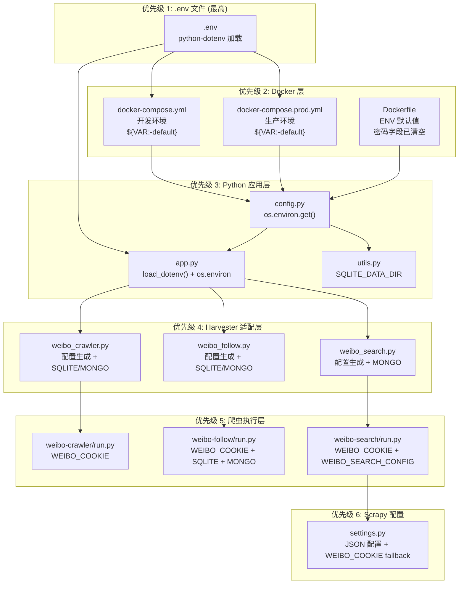

# WeiboHarvester — 环境配置信息全景分析报告

> 生成时间：2026-05-21
> 分析范围：项目所有与配置、环境变量、凭据相关的文件
> 状态：已完成环境变量全面外部化（所有配置均可从 .env 控制）
>
> 📖 **阅读建议**：本文面向运维/系统管理员。如需项目整体介绍，请先阅读 [README.md](./README.md)；如需使用教程，请阅读 [USAGE.md](./USAGE.md)。

---

## 一、概况

项目提供 **`.env.example`** 模板文件，**`gui-web/app.py` 已集成 `python-dotenv`**，启动时自动加载项目根目录 `.env` 文件。用户只需复制并编辑 `.env` 一个文件即可完全自定义所有配置。

所有 docker-compose 中的硬编码值已全部改为 `${VAR:-default}` 语法，保留向后兼容。

所有环境变量通过以下四种方式注入：

| 方式 | 涉及文件 |
|------|----------|
| `.env` 文件（推荐，通过 `python-dotenv`） | 项目根目录 `.env`（从 `.env.example` 复制） |
| Docker Compose `environment:` 字段（`${VAR:-default}` 语法） | `docker-compose.yml`, `docker-compose.prod.yml`, `dist/docker-compose.prod.yml` |
| Dockerfile `ENV` 指令 | `Dockerfile`（仅默认值 fallback，密码字段为空） |
| Python 代码中 `os.environ.get()` 运行时读取 | `gui-web/config.py`, `gui-web/app.py`, `gui-web/utils.py`, 各 `tools/.../run.py` |

---

## 二、核心配置层次图

```
┌─────────────────────────────────────────────────────────────────┐
│  1. .env 文件 (手动创建，最高优先级，通过 python-dotenv 加载)         │
│     └── 项目根目录 .env 文件                                      │
├─────────────────────────────────────────────────────────────────┤
│  2. Docker Compose / Dockerfile  (环境变量定义)                    │
│     ├── docker-compose.yml              开发环境                 │
│     ├── docker-compose.prod.yml         生产环境                 │
│     ├── dist/docker-compose.prod.yml    分发版生产                │
│     └── Dockerfile                      ENV 默认值 (密码字段已清空) │
├─────────────────────────────────────────────────────────────────┤
│  3. gui-web/config.py  (Python 配置，从环境变量读取)               │
│     ├── FLASK_HOST / FLASK_PORT / FLASK_DEBUG 从 os.environ 读取   │
│     ├── 路径常量（容器内固定路径）                                   │
│     └── DEFAULT_SETTINGS (完整的 settings JSON 模板)              │
├─────────────────────────────────────────────────────────────────┤
│  4. gui-web/app.py  (Flask 运行时读取环境变量 + dotenv 加载)       │
│     ├── load_dotenv() 加载 .env                                   │
│     ├── FLASK_SECRET_KEY, API_TOKEN, MAX_CRAWLER_RUNTIME         │
│     └── WEIBO_COOKIE (注入子进程环境变量)                            │
├─────────────────────────────────────────────────────────────────┤
│  5. gui-web/utils.py  (文件路径 + SQLite 目录环境变量)              │
│     └── SQLITE_DATA_DIR                                            │
├─────────────────────────────────────────────────────────────────┤
│  6. gui-web/harvesters/weibo_*.py  (爬虫配置生成，含环境变量读取)     │
│     ├── SQLITE_DATA_DIR                                            │
│     └── MONGODB_URI                                                 │
├─────────────────────────────────────────────────────────────────┤
│  7. tools/dataabc/weibo-*/run.py  (各爬虫入口，环境变量读取)          │
│     ├── WEIBO_COOKIE                                              │
│     ├── SQLITE_DATA_DIR                                            │
│     ├── MONGODB_URI                                                 │
│     └── WEIBO_SEARCH_CONFIG (Scrapy 使用)                          │
├─────────────────────────────────────────────────────────────────┤
│  8. tools/dataabc/weibo-search/weibo/settings.py  (Scrapy 配置)    │
│     └── 从 WEIBO_SEARCH_CONFIG 动态加载 JSON                        │
│     └── WEIBO_COOKIE 作为 cookie fallback                          │
└─────────────────────────────────────────────────────────────────┘
```



---

## 三、逐文件详细分析

### 3.1 根目录 Docker 配置文件

#### ① `Dockerfile` (主容器镜像)

**定义的 ENV 变量** (共 22 个)：

| 变量名 | 当前值 | 说明 |
|--------|--------|------|
| `PYTHONUNBUFFERED` | `1` | Python 输出不缓冲 |
| `FLASK_SECRET_KEY` | `""` | Flask session 加密密钥（⚠️ 空值，生产需覆盖） |
| `API_TOKEN` | `""` | API 认证令牌（⚠️ 空值） |
| `SQLITE_DATA_DIR` | `/app/data/sqlite` | SQLite 数据目录 |
| `MONGODB_URI` | `mongodb://weibo-mongo:27017/` | MongoDB 连接地址 |
| `MYSQL_HOST` | `weibo-mysql` | MySQL 主机名 |
| `MYSQL_PORT` | `3306` | MySQL 端口 |
| `MYSQL_USER` | `root` | MySQL 用户名 |
| `MYSQL_PASSWORD` | `""` ⚠️ | MySQL 密码（已清空，需通过 .env 或 compose 注入） |
| `MYSQL_DATABASE` | `weibo_crawler` | MySQL 数据库名（compose 默认 `weibo_harvester`，可通过 `.env` 覆盖） |
| `ANTI_BAN_ENABLED` | `true` | 反封禁开关 |
| `MAX_WEIBO_PER_SESSION` | `500` | 每会话最大微博数 |
| `BATCH_SIZE` | `50` | 批次大小 |
| `BATCH_DELAY` | `30` | 批次延迟(秒) |
| `REQUEST_DELAY_MIN` | `8` | 请求最小延迟(秒) |
| `REQUEST_DELAY_MAX` | `15` | 请求最大延迟(秒) |
| `MAX_SESSION_TIME` | `600` | 最大会话时间(秒) |
| `MAX_API_ERRORS` | `5` | 最大 API 错误次数 |
| `REST_TIME_MIN` | `180` | 休息时间(秒) |
| `WRITE_MODE` | `csv,json` | 输出格式（默认不含 mysql，需配合 `--profile mysql` 启动 MySQL 容器后手动添加） |
| `OUTPUT_DIRECTORY` | `/app/data` | 输出目录 |
| `LOG_LEVEL` | `INFO` | 日志级别 |

**关键说明**：
- `MYSQL_PASSWORD` 已清空为 `""`，不再在镜像中硬编码密码
- `MYSQL_DATABASE` 在 Dockerfile 中为 `weibo_crawler`，在 compose 中默认 `weibo_harvester`（可通过 `.env` `MYSQL_DATABASE` 自定义）

#### ② `docker-compose.yml` (开发版)

定义了 3 个服务，所有值均采用 `${VAR:-default}` 语法，可从 `.env` 覆盖。

**MySQL 和 MongoDB 通过 Docker Compose profiles 机制按需启动**（`profiles: [mysql, db]` 和 `profiles: [mongo, db]`），默认不启动，避免不必要的资源占用。weibo-harvester 服务的 `depends_on` 已设置 `required: false`，数据库不存在时不影响主服务启动。

网络模式使用 `driver: bridge`（由 Docker Compose 自动创建），无需手动 `docker network create`。

**mysql 服务**（profile: `mysql`, `db`）：
- `MYSQL_ROOT_PASSWORD=${MYSQL_PASSWORD:-weibo_harvester_password}` — 开发环境有默认值，生产版强制读取 `.env`
- `MYSQL_DATABASE=${MYSQL_DATABASE:-weibo_harvester}`
- `TZ=${TZ:-Asia/Shanghai}`
- 端口：`"${MYSQL_EXTERNAL_PORT:-3306}:3306"`（宿主机端口可配）

**mongo 服务**（profile: `mongo`, `db`）:
- `TZ=${TZ:-Asia/Shanghai}`
- 端口：`"${MONGO_EXTERNAL_PORT:-27017}:27017"`（宿主机端口可配）

**weibo-harvester 服务**（15+ 个变量均可从 `.env` 覆盖）:
- `FLASK_ENV=${FLASK_ENV:-development}`
- `FLASK_DEBUG=${FLASK_DEBUG:-1}`
- `FLASK_SECRET_KEY=${FLASK_SECRET_KEY:-}`
- `API_TOKEN=${API_TOKEN:-}`
- `MYSQL_PASSWORD=${MYSQL_PASSWORD:-weibo_harvester_password}` — 开发环境有默认值
- `MYSQL_HOST=${MYSQL_HOST:-weibo-mysql}`, `MYSQL_PORT=${MYSQL_PORT:-3306}`, `MYSQL_USER=${MYSQL_USER:-root}`, `MYSQL_DATABASE=${MYSQL_DATABASE:-weibo_harvester}`
- `MONGODB_URI=${MONGODB_URI:-mongodb://weibo-mongo:27017/}`
- `SQLITE_DATA_DIR=${SQLITE_DATA_DIR:-/app/data/sqlite}`
- `PYTHONUNBUFFERED=${PYTHONUNBUFFERED:-1}`, `TZ=${TZ:-Asia/Shanghai}`
- 端口：`"${FLASK_PORT:-5100}:${FLASK_PORT:-5100}"`（容器内/外双向跟随）
- healthcheck URL：`http://localhost:${FLASK_PORT:-5100}/health`（动态跟随端口）

**容器名**: `weibo-mysql`, `weibo-mongo`, `weibo-harvester`
**镜像**: `weiboharvester:1.3`

#### ③ `docker-compose.prod.yml` 与 ④ `dist/docker-compose.prod.yml`

两者内容完全一致，均从同一模板生成（仅分发版顶部注释不同）。

与开发版区别：
- `FLASK_ENV=${FLASK_ENV:-production}`（默认生产模式，`FLASK_DEBUG` 不设置）
- 不挂载代码目录（代码在镜像内）
- 网络模式: `driver: bridge`（非 external）
- 镜像名: `weiboharvester:1.3`
- **同样支持 profiles 机制**：MySQL/MongoDB 默认不启动，通过 `--profile` 参数按需开启
- `depends_on` 设置 `required: false`，数据库不存在不影响主服务启动
- 包含 SQLite 数据卷挂载（`./data/sqlite:/app/data/sqlite`）

**同样采用 `${VAR:-default}` 语法，所有配置可从 `.env` 覆盖。**

---

### 3.2 `gui-web/config.py` (Python 配置)

核心配置中心，通过 `os.environ.get()` 从环境变量读取可配置项：

| 常量 | 值 | 读取方式 |
|------|-----|----------|
| `FLASK_HOST` | `0.0.0.0`（默认） | `os.environ.get('FLASK_HOST', '0.0.0.0')` |
| `FLASK_PORT` | `5100`（默认） | `int(os.environ.get('FLASK_PORT', '5100'))` |
| `FLASK_DEBUG` | `False`（默认） | `os.environ.get('FLASK_DEBUG', '0') == '1'` |
| `CRAWLER_PATHS` | `/app/weibo-crawler` 等 | 容器内固定路径 |
| `LOGS_DIR` | `/app/logs` | 容器内固定路径 |
| `TEMP_DIR` | `/app/temp/gui-web` | 容器内固定路径 |
| `SETTINGS_FILE` | `/app/temp/gui-web/settings.json` | 容器内固定路径 |
| `STATUS_FILE` | `/app/temp/gui-web/status.json` | 容器内固定路径 |
| `HISTORY_FILE` | `/app/temp/gui-web/history.json` | 容器内固定路径 |

**关键改造**：`FLASK_HOST` / `FLASK_PORT` / `FLASK_DEBUG` 已从硬编码改为从环境变量读取，用户只需在 `.env` 中设置即可覆盖。

`DEFAULT_SETTINGS` 模板（约 170 行）：
- `mysql_config.password`: `""`（空值）
- `mongo_config.uri`: `"mongodb://weibo-mongo:27017/"`
- `sqlite_config.db_path`: `"/app/data/sqlite/weibodata.db"`
- `cookie`: `""`
- 各爬虫默认参数
- `ui_state` 前端状态

---

### 3.3 `gui-web/app.py` (Flask 运行时)

**`python-dotenv` 集成**（第 19-27 行）：
```python
from dotenv import load_dotenv

_env_path = Path(__file__).resolve().parent.parent / '.env'
if _env_path.exists():
    load_dotenv(_env_path)
else:
    load_dotenv()  # fallback
```

**运行时读取的 3 个环境变量**：
```python
app.config['SECRET_KEY'] = os.environ.get('FLASK_SECRET_KEY', os.urandom(24).hex())
MAX_CRAWLER_RUNTIME_SECONDS = int(os.environ.get('MAX_CRAWLER_RUNTIME', '86400'))
API_TOKEN = os.environ.get('API_TOKEN', '').strip()
```

**Cookie 安全传递机制**（第 413-424 行）：
```python
subprocess_env = os.environ.copy()
if global_cookie:
    subprocess_env['WEIBO_COOKIE'] = global_cookie
# ...
env=subprocess_env,  # 注入子进程
```

**`/health` 健康检查端点**（第 250+ 行）：
返回 Flask 应用和数据库连接的整体健康状态，包含：
- `status`：`healthy` / `crawler_running`（爬虫进程运行中）
- `databases`：`mysql` / `mongo` / `sqlite` 各自的可达性状态（`available` / `unavailable` / `not_configured`）

数据库检查仅在对应配置 `enabled: true` 时执行，仅探测网络可达性（连接超时 3 秒），不抛出异常。

**导入路径**（第 55-57 行）：
```python
from harvesters.weibo_crawler import generate_config as generate_weibo_crawler_config
from harvesters.weibo_follow import generate_config as generate_weibo_follow_config
from harvesters.weibo_search import generate_config as generate_weibo_search_config
```

---

### 3.4 `gui-web/utils.py`

涉及 `os.environ.get()` 的 2 处：

```python
# 第 375 行 - extract_output_targets()
sqlite_data_dir = os.environ.get("SQLITE_DATA_DIR", "/app/data/sqlite")

# 第 392 行 - extract_output_targets()
os.environ.get('SQLITE_DATA_DIR', '/app/data/sqlite')
```

---

### 3.5 爬虫配置生成模块 (`gui-web/harvesters/`)

#### `weibo_crawler.py`
- `DEFAULT_SQLITE_DB_PATH = os.path.join(os.environ.get("SQLITE_DATA_DIR", "/app/data/sqlite"), "weibodata.db")`
- Cookie 不写入磁盘 JSON 文件
- MongoDB URI：优先前端 > 全局 mongo_config

#### `weibo_follow.py`
- `DEFAULT_SQLITE_DB_PATH = os.path.join(os.environ.get("SQLITE_DATA_DIR", "/app/data/sqlite"), "weibo_follow.db")`
- MongoDB URI：优先前端 > 全局 config > `os.environ.get("MONGODB_URI", "")`

#### `weibo_search.py`
- MongoDB URI：优先前端 > 全局 config > `os.environ.get("MONGODB_URI", "mongodb://weibo-mongo:27017/")`
- MySQL 配置通过 `generate_config` 参数 `mysql_config` 传入（来自 `config.py` 的 `DEFAULT_SETTINGS`）

---

### 3.6 爬虫入口模块 (`tools/dataabc/`)

#### `weibo-crawler/run.py`
```python
cookie_from_env = os.environ.get('WEIBO_COOKIE', '')  # 第 40 行
```

#### `weibo-crawler/weibo.py`
```python
cookie_config = config.get("cookie")
cookie_string = os.environ.get("WEIBO_COOKIE") or cookie_config  # 第 133 行（legacy 兼容）
```

#### `weibo-follow/run.py`
```python
# 第 82-83 行 - SQLite 路径
os.environ.get('SQLITE_DATA_DIR', '/app/data/sqlite')
# 第 180-181 行 - MongoDB URI
os.environ.get('MONGODB_URI', 'mongodb://weibo-mongo:27017/')
# 第 262 行 - Cookie
cookie_from_env = os.environ.get('WEIBO_COOKIE', '')
```
- 类名已改为 `HarvesterFollow`

#### `weibo-search/run.py`
```python
cookie_from_env = os.environ.get('WEIBO_COOKIE', '')  # 第 35 行
os.environ["WEIBO_SEARCH_CONFIG"] = config_path             # 第 47 行
os.environ.setdefault("SCRAPY_SETTINGS_MODULE", "weibo.settings")  # 第 48 行
```

#### `weibo-search/weibo/settings.py` (Scrapy 动态配置)
```python
_config_path = os.environ.get('WEIBO_SEARCH_CONFIG', '')                    # 第 7 行
_cookie = _cfg.get('cookie', '') or os.environ.get('WEIBO_COOKIE', '')  # 第 22 行
```
- MySQL/MongoDB 连接参数在启用时从配置文件动态注入

---

### 3.7 辅助脚本

#### `start.py`
- `GUI_URL = f"http://localhost:{os.environ.get('FLASK_PORT', '5100')}"` — 动态拼接，跟随 `FLASK_PORT`
- `APP_ROOT = Path('/app')` — 容器内固定路径

#### `menu.sh`
- 委托给 `start.py`

#### `requirements-all.txt`
- 包含 `python-dotenv>=1.0.0`（**现在实际已使用**）

---

## 四、系统环境变量完整清单（最终）

| 序号 | 变量名 | 用途 | 默认值 | 定义位置 | 变更说明 |
|------|--------|------|--------|----------|----------|
| 1 | `FLASK_HOST` | Flask 监听地址 | `0.0.0.0` | config.py (os.environ) | ⚡ 新增，可在 .env 覆盖 |
| 2 | `FLASK_PORT` | Flask 监听端口 | `5100` | config.py + compose | ⚡ 新增，改端口只需改此处 |
| 3 | `FLASK_DEBUG` | Flask 调试模式（字符串 "0"/"1"） | 开发=`1`, 生产=`0` | config.py + compose | ⚡ 新增，类型字符串 |
| 4 | `MYSQL_EXTERNAL_PORT` | MySQL 宿主机端口映射 | `3306` | compose | ⚡ 新增，仅影响宿主机映射 |
| 5 | `MONGO_EXTERNAL_PORT` | MongoDB 宿主机端口映射 | `27017` | compose | ⚡ 新增，仅影响宿主机映射 |
| 6 | `FLASK_SECRET_KEY` | Flask session 加密 | `""` (随机生成) | Dockerfile, compose | 无变更 |
| 7 | `API_TOKEN` | API 认证令牌 | `""` | Dockerfile, compose | 无变更 |
| 8 | `WEIBO_COOKIE` | 微博 Cookie（子进程安全传递） | `""` | app.py 注入 | ⚡ 曾用名: `WORKBUDDY_COOKIE` → `HARVESTER_COOKIE` |
| 9 | `WEIBO_COOKIE` | 微博 Cookie（legacy，weibo.py 读取） | `""` | weibo.py 读取 | 无变更（legacy 兼容） |
| 10 | `WEIBO_SEARCH_CONFIG` | Scrapy 配置 JSON 路径 | `""` | run.py 动态设置 | 无变更 |
| 11 | `SCRAPY_SETTINGS_MODULE` | Scrapy 设置模块名 | 由 run.py 设置 | run.py | 无变更 |
| 12 | `SQLITE_DATA_DIR` | SQLite 数据目录 | `/app/data/sqlite` | Dockerfile, compose (`${:-}`) | ⚡ compose 中改为 `${SQLITE_DATA_DIR:-/app/data/sqlite}` |
| 13 | `MONGODB_URI` | MongoDB 连接串 | `mongodb://weibo-mongo:27017/` | Dockerfile, compose (`${:-}`) | ⚡ compose 中改为 `${MONGODB_URI:-...}` |
| 14 | `MYSQL_HOST` | MySQL 主机 | `weibo-mysql` | Dockerfile, compose (`${:-}`) | ⚡ compose 中改为 `${MYSQL_HOST:-weibo-mysql}` |
| 15 | `MYSQL_PORT` | MySQL 端口 | `3306` | Dockerfile, compose (`${:-}`) | ⚡ compose 中改为 `${MYSQL_PORT:-3306}` |
| 16 | `MYSQL_USER` | MySQL 用户 | `root` | Dockerfile, compose (`${:-}`) | ⚡ compose 中改为 `${MYSQL_USER:-root}` |
| 17 | `MYSQL_PASSWORD` | MySQL 密码 | `""` ⚠️ | Dockerfile, compose | ⚡ 曾硬编码 `weibo_2026`，现为空 |
| 18 | `MYSQL_DATABASE` | MySQL 数据库 | compose=`weibo_harvester` / Dockerfile=`weibo_crawler` | Dockerfile, compose (`${:-}`) | ⚡ `.env` 优先，compose 默认 `weibo_harvester` |
| 19 | `MAX_CRAWLER_RUNTIME` | 最大运行时间(秒) | `86400` | app.py | 无变更 |
| 20 | `FLASK_ENV` | Flask 运行环境 | 开发=`development`, 生产=`production` | compose (`${:-}`) | ⚡ compose 中改为 `${FLASK_ENV:-...}` |
| 21 | `TZ` | 时区 | `Asia/Shanghai` | compose (`${:-}`) | 无变更 |
| 22 | `PYTHONUNBUFFERED` | Python 输出不缓冲 | `1` | Dockerfile, compose (`${:-}`) | ⚡ compose 中改为 `${PYTHONUNBUFFERED:-1}` |
| 23-31 | `ANTI_BAN_*` 系列 | 反封禁策略参数 | 见 Dockerfile | Dockerfile | 无变更 |
| 32 | `WRITE_MODE` | 输出格式 | `csv,json,mysql` | Dockerfile | 无变更 |
| 33 | `OUTPUT_DIRECTORY` | 输出目录 | `/app/data` | Dockerfile | 无变更 |
| 34 | `LOG_LEVEL` | 日志级别 | `INFO` | Dockerfile | 无变更 |
| 35 | `MYSQL_ROOT_PASSWORD` | MySQL root 密码 (compose) | `${MYSQL_PASSWORD}` | compose (mysql 服务) | ⚡ 曾为 `${MYSQL_PASSWORD:-weibo_2026}` |

**端口联动机制**：
- `FLASK_PORT` 同时控制 Flask 容器内监听端口 + 宿主机映射端口 + healthcheck URL + GUI 入口 URL
- `MYSQL_EXTERNAL_PORT` / `MONGO_EXTERNAL_PORT` 仅控制宿主机映射端口（容器内部端口不变）

---

## 五、硬编码数值/路径汇总（含可配置性说明）

| 值 | 位置 | 类型 | 可配置性 |
|-----|------|------|----------|
| `5100` | Dockerfile, compose, config.py | Flask 默认端口 | ✅ `.env` `FLASK_PORT` 可覆盖 |
| `3306` | Dockerfile, compose, config.py | MySQL 默认端口 | ✅ `.env` `MYSQL_PORT` / `MYSQL_EXTERNAL_PORT` 可覆盖 |
| `27017` | 多处 | MongoDB 默认端口 | ✅ `.env` `MONGO_EXTERNAL_PORT` 可覆盖 |
| `""` (空) | Dockerfile, compose | MySQL 密码（已清空） | ✅ `.env` `MYSQL_PASSWORD` 按需设置 |
| `weibo-mysql` | Dockerfile, compose | MySQL 容器名 | ✅ `.env` `MYSQL_HOST` 可覆盖 |
| `weibo-mongo` | Dockerfile, compose | MongoDB 容器名 | ✅ `.env` `MONGODB_URI` 可覆盖 |
| `weibo_harvester` / `weibo_crawler` | Dockerfile, compose | MySQL 数据库名（compose 覆盖 Dockerfile） | ✅ `.env` `MYSQL_DATABASE` 可覆盖 |
| `weiboharvester:1.3` | compose ×3 | Docker 镜像名 | 固定（需改 compose 文件） |
| `weibo-harvester` | compose ×3 | 容器名 | 固定（需改 compose 文件） |
| `/app/data/sqlite` | Dockerfile, config.py, utils.py | SQLite 目录 | ✅ `.env` `SQLITE_DATA_DIR` 可覆盖 |
| `/app/data` | Dockerfile, start.py | 数据根目录 | 容器内固定路径 |
| `/app/logs` | config.py | 日志目录 | 容器内固定路径 |
| `0.0.0.0` | config.py | Flask 监听地址 | ✅ `.env` `FLASK_HOST` 可覆盖 |
| `500` | Dockerfile, config.py | 反封禁默认值 | ✅ `.env` `MAX_WEIBO_PER_SESSION` 等可覆盖 |
| `30` | Dockerfile, config.py | 批次延迟默认值 | ✅ `.env` `BATCH_DELAY` 等可覆盖 |
| `86400` | app.py | 最大运行时间默认(24h) | ✅ `.env` `MAX_CRAWLER_RUNTIME` 可覆盖 |
| `迪丽热巴` | config.py, settings.py | 搜索默认关键词 | 前端动态设置 |

---

## 六、安全问题评估

### 🔴 严重风险

| 问题 | 详情 | 状态 |
|------|------|------|
| 真实 Cookie 明文存储 | `temp/gui-web/settings.json` 和 `runtime-configs/weibo-crawler/*.json` 中包含真实微博 Cookie | ⚠️ 仍存在 |
| MySQL 密码硬编码 | 原 `weibo_2026` 出现在 Dockerfile、3 个 compose 文件中 | ✅ 已修复（清空） |

### 🟡 中等风险

| 问题 | 详情 | 状态 |
|------|------|------|
| FLASK_SECRET_KEY 默认为空 | 生产环境若不设置，每次重启生成新密钥，session 失效 | ⚠️ 仍存在 |
| API_TOKEN 默认为空 | 未启用 API 认证，任何可访问 GUI 端口的人都能操作爬虫 | ⚠️ 仍存在 |
| MongoDB 无认证 | 连接串无用户名密码，仅靠容器网络隔离 | ⚠️ 仍存在 |

### 🟢 低风险 / 已改进

| 问题 | 详情 | 状态 |
|------|------|------|
| `python-dotenv` 已安装但未使用 | 原 `requirements-all.txt` 中有依赖但无加载逻辑 | ✅ 已修复（app.py 集成 load_dotenv） |
| 原始模板密码 `123456` | 仅在 `tools/dataabc/original/` 中出现，不影响运行 | ⚠️ 无害 |

---

## 七、建议改进

1. **从 `.env.example` 创建 `.env`**：复制 `.env.example` → `.env`，根据实际需要填写各项配置即可启动
2. **生产环境建议设置密钥**：如需使用 MySQL，确保 `MYSQL_PASSWORD` 已设置；如需固定 session，确保 `FLASK_SECRET_KEY` 已设置；公网部署建议设置 `API_TOKEN`
3. **Cookie 安全**：`runtime-configs/weibo-crawler/*.json` 中老文件可能残留 cookie 字段（代码已避免写入，但历史文件需手动清理）
4. **`.gitignore` 确认**：确保 `temp/` 和 `.env` 已在 `.gitignore` 中
5. **端口冲突**：如默认端口被占用，在 `.env` 中修改 `FLASK_PORT` / `MYSQL_EXTERNAL_PORT` / `MONGO_EXTERNAL_PORT` 即可

---

## 八、涉及文件索引 (共 31 个文件)

| # | 文件路径 | 配置类型 |
|---|----------|----------|
| 1 | `Dockerfile` | ENV 环境变量 |
| 2 | `docker-compose.yml` | Compose `${VAR:-default}` 环境变量 |
| 3 | `docker-compose.prod.yml` | Compose `${VAR:-default}` 环境变量 |
| 4 | `dist/docker-compose.prod.yml` | Compose `${VAR:-default}` 环境变量 |
| 5 | `.env.example` | .env 模板文件（新增） |
| 6 | `gui-web/config.py` | Python os.environ 读取 |
| 7 | `gui-web/app.py` | 运行时 os.environ + dotenv |
| 8 | `gui-web/utils.py` | 运行时 os.environ |
| 9 | `gui-web/harvesters/weibo_crawler.py` | 配置生成 + os.environ |
| 10 | `gui-web/harvesters/weibo_follow.py` | 配置生成 + os.environ |
| 11 | `gui-web/harvesters/weibo_search.py` | 配置生成 + os.environ |
| 12 | `tools/dataabc/weibo-crawler/run.py` | 入口 + os.environ |
| 13 | `tools/dataabc/weibo-crawler/weibo.py` | os.environ |
| 14 | `tools/dataabc/weibo-crawler/const.py` | 通知配置常量 |
| 15 | `tools/dataabc/weibo-crawler/util/notify.py` | 硬编码 URL |
| 16 | `tools/dataabc/weibo-follow/run.py` | 入口 + os.environ |
| 17 | `tools/dataabc/weibo-search/run.py` | 入口 + os.environ |
| 18 | `tools/dataabc/weibo-search/weibo/settings.py` | Scrapy 动态配置 |
| 19 | `start.py` | 动态 URL/路径 |
| 20 | `menu.sh` | 委托脚本 |
| 21 | `requirements-all.txt` | 依赖清单 (含 python-dotenv) |
| 22 | `temp/gui-web/settings.json` | 运行时持久化设置 |
| 23 | `temp/gui-web/status.json` | 运行时状态 |
| 24 | `temp/gui-web/history.json` | 运行历史 |
| 25-27 | `temp/gui-web/runtime-configs/weibo-*/*.json` | 爬虫配置快照 |
| 28 | `tools/dataabc/original/weibo-crawler-master/config.json` | 原始模板 |
| 29 | `tools/dataabc/original/weibo-follow-master/config.json` | 原始模板 |
| 30 | `tools/dataabc/original/weibo-search-master/config.json` | 原始模板 |
| 31 | `tools/dataabc/original/weibo-search-master/weibo/settings.py` | 原始模板 |

---

*最后更新：2026-05-21*
