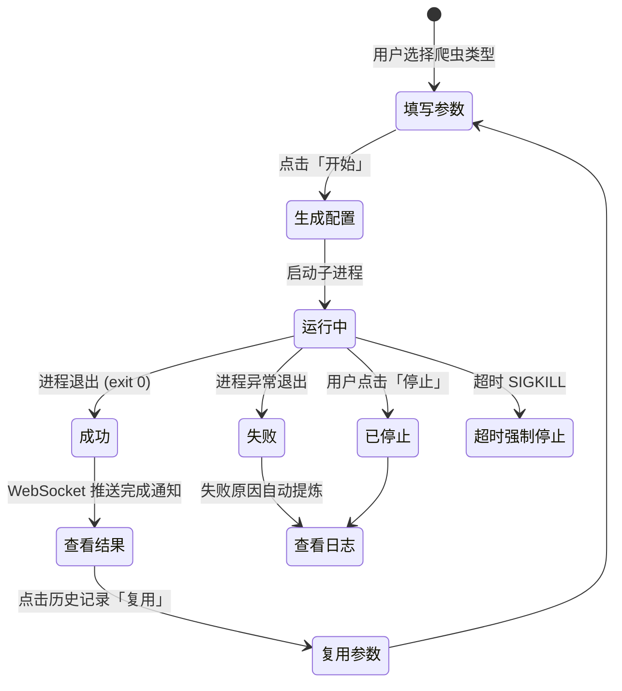

# WeiboHarvester — 使用手册

> 版本：1.3 | GUI 端口：5100  
> 面向最终用户：部署、操作、排障的完整指南

---

## 一、快速上手（3 步）

### 前提

- Docker Desktop 或 Docker Engine 已安装
- 4GB 以上可用磁盘空间
- 确保所需端口未被占用（默认 `5100`，如冲突可在 `.env` 中修改 `FLASK_PORT`）

### 1. 配置环境变量

```bash
# 从模板创建 .env 文件
cp .env.example .env

# 编辑 .env，至少设置：
#   MYSQL_PASSWORD=your_password    # MySQL 密码（如使用 MySQL）
#   FLASK_SECRET_KEY=随机字符串      # Flask 会话加密密钥（生产建议固定值）
```

生成安全密钥：
```bash
openssl rand -hex 32   # 或 python3 -c "import secrets; print(secrets.token_hex(32))"
```

### 2. 启动容器

项目通过 Docker Compose **profiles** 机制支持按需启动 MySQL 和/或 MongoDB 数据库服务。默认不启动任何外部数据库，爬虫仍可通过 CSV / JSON / Markdown / SQLite 输出数据。

#### 数据库服务 Profile 对照表

| Profile | 启动的服务 | 适用场景 |
|---------|-----------|----------|
| 不指定 | weibo-harvester 仅主服务 | 仅需 CSV/JSON/Markdown/SQLite 输出 |
| `--profile mysql` | weibo-harvester + MySQL | 需要 MySQL 数据库输出 |
| `--profile mongo` | weibo-harvester + MongoDB | 需要 MongoDB 数据库输出 |
| `--profile db` | weibo-harvester + MySQL + MongoDB | 同时需要两种数据库 |

**方式 A：生产模式（推荐）**

```bash
# 仅爬虫（不开数据库，CSV/JSON/Markdown/SQLite 输出不受影响）
docker compose -f docker-compose.prod.yml up -d

# 爬虫 + MySQL
docker compose -f docker-compose.prod.yml --profile mysql up -d

# 爬虫 + MongoDB
docker compose -f docker-compose.prod.yml --profile mongo up -d

# 爬虫 + MySQL + MongoDB（等同于旧版行为）
docker compose -f docker-compose.prod.yml --profile db up -d
```

**方式 B：开发模式（支持代码热更新）**

```bash
# 同上，将 -f 参数改为 docker-compose.yml
docker compose up -d                              # 仅爬虫
docker compose --profile mysql up -d              # 爬虫 + MySQL
docker compose --profile mongo up -d              # 爬虫 + MongoDB
docker compose --profile db up -d                 # 爬虫 + 两者
```

**方式 C：直接 docker run（不使用外部数据库）**
```bash
docker run -d \
  -p ${FLASK_PORT:-5100}:${FLASK_PORT:-5100} \
  -v $(pwd)/data:/app/data \
  -v $(pwd)/logs:/app/logs \
  -v $(pwd)/temp:/app/temp \
  --name weibo-harvester \
  --restart unless-stopped \
  weiboharvester:1.3
```

> **向下兼容**：使用 `--profile db` 等同于旧版本默认启动全部服务的行为。如果不指定 profile，MySQL/MongoDB 容器不会启动，不影响爬虫核心功能。

### 3. 访问 GUI

浏览器打开：**http://localhost:5100**

---

## 二、GUI 页面详解

顶部导航栏包含 6 个入口，按使用频率排列：

### 2.1 首页（Dashboard）

运行状态总览 + 历史记录表格：

| 功能 | 操作 |
|------|------|
| 查看运行状态 | 顶部状态栏显示当前运行中的任务 |
| 筛选历史 | 按爬虫类型、状态筛选，支持分页 |
| 复用参数 | 点击「复用」→ 回填到对应表单 |
| 查看日志 | 点击「日志」→ 弹窗实时查看 |
| 删除记录 | 点击「删除」→ 联动清理对应配置文件 |

### 2.2 微博爬虫（weibo-crawler）

最完整的模块，7 个配置分区：

| 分区 | 关键参数 | 说明 |
|------|----------|------|
| **基本爬取** | `user_id_list`、`since_date`、`end_date` | 目标用户 ID + 时间范围 |
| **内容过滤** | `only_crawl_original`、`query_list` | 仅原创 / 按关键词过滤 |
| **输出配置** | `write_mode` | csv/json/markdown/sqlite/mysql/mongodb 多选 |
| **图片/视频** | 6 个下载开关 | 原帖/转发的图片、视频、LivePhoto |
| **评论/转发** | `download_comment`、`download_repost` | 下载评论和转发内容 |
| **数据库** | sqlite/mysql/mongodb 连接 | 各数据库独立配置 |
| **反封禁** | 9 项策略 | 请求延迟、批次暂停、会话休息等 |

**快速使用示例：**

1. 在全局设置中粘贴微博 Cookie
2. 输入目标用户 ID（如 `1669879400`）
3. 设置日期范围（如 `since_date: 2026-01-01`）
4. 勾选需要的输出格式（至少选 csv）
5. 点击「开始运行」

### 2.3 关注列表（weibo-follow）

批量获取用户的关注列表：

| 参数 | 说明 |
|------|------|
| `user_id_list` | 目标用户 ID 列表 |
| 输出 | 自动生成 `{user_id}_{时间戳}_user_id_list.txt` |

**链式用法**：关注列表的 user_id 可以再作为 weibo-crawler 的输入。

### 2.4 关键词搜索（weibo-search）

基于 Scrapy 的关键词搜索，支持精细过滤：

| 参数 | 说明 | 默认值 |
|------|------|--------|
| `keyword` | 搜索关键词 | 必填 |
| `start_time` / `end_time` | 时间范围 | 当天 |
| `search_type` | 微博类型：0=全部 1=原创 2=热门 3=关注 4=认证用户 5=媒体 6=观点 | `1` |
| `filter_type` | 包含类型：0=全部 1=图片 2=视频 3=音乐 4=短链接 | `0` |
| `region` | 地区筛选，逗号分隔多地区 | `全部` |
| `limit_result` | 结果数量限制，0=不限制 | `0` |
| `wait_time` | 请求延迟（秒） | `5` |

**智能搜索特性**：结果超过阈值时自动按天→小时→省份→城市逐级拆分搜索，最大化避免数据截断。

### 2.5 日志管理

| 操作 | 说明 |
|------|------|
| 查看日志列表 | 所有模块的日志文件，按时间排序 |
| 查看日志内容 | 点击文件名查看（暗色终端风格） |
| 清空日志 | 按模块清空或全部清空 |
| 删除单条 | 删除指定日志文件 |

### 2.6 全局设置

| 设置项 | 说明 |
|--------|------|
| **Cookie** | 微博登录 Cookie，支持在线验证（实际请求微博 API 检测） |
| **时区** | 默认 `Asia/Shanghai`，影响时间戳显示 |
| **MySQL 配置** | 连接信息，支持连接测试（5 秒超时） |
| **MongoDB 配置** | URI 连接串，支持 ping 连接测试（5 秒超时） |
| **SQLite 配置** | 数据库文件路径，支持路径可用性测试 |
| **日志配置** | 保留行数、文件大小限制、备份数 |

---

## 三、任务管理全流程

### 启动任务

```
填写参数 → 点击「开始」
→ GUI 生成唯一 JSON 配置文件
→ 启动爬虫子进程
→ 创建历史记录（状态: running）
→ 实时日志通过 WebSocket 推送
```

### 监控任务

- **首页状态栏**：实时显示当前运行任务
- **实时日志**：点击历史记录中的「日志」按钮查看
- **完成通知**：任务结束自动推送 WebSocket 通知

### 停止任务

```
点击「停止」
→ 发送 SIGTERM 信号（优雅退出）
→ 等待 10 秒
→ 超时则发送 SIGKILL（强制终止）
→ 更新历史记录
```

### 任务生命周期流程图



### 复用任务

在历史记录中找到目标 → 点击「复用」→ 参数自动回填到表单 → 修改后重新启动。

---

## 四、常用命令参考

```bash
# 查看容器状态
docker ps

# 查看 GUI 日志
docker logs -f weibo-harvester

# 停止服务
docker compose down

# 重启服务
docker compose restart

# 进入容器调试
docker exec -it weibo-harvester bash

# 进入容器后手动运行爬虫
python3 /app/start.py
```

---

## 五、数据输出说明

### 文件输出位置

| 模块 | 容器内路径 | 宿主机路径 |
|------|-----------|-----------|
| weibo-crawler | `/app/data/weibo-crawler/` | `./data/weibo-crawler/` |
| weibo-follow | `/app/data/weibo-follow/` | `./data/weibo-follow/` |
| weibo-search | `/app/data/weibo-search/` | `./data/weibo-search/` |

### 输出格式说明

| 格式 | 适用模块 | 说明 |
|------|----------|------|
| CSV | crawler / search | 表格数据，可用 Excel 打开 |
| JSON | crawler | 结构化数据，适合程序处理 |
| Markdown | crawler | 按日期拆分，适合阅读 |
| SQLite | crawler / follow / search | 单文件数据库，WAL 模式，幂等写入 |
| MySQL | crawler / follow / search | 远程数据库（需 Docker Compose 启动），ON DUPLICATE KEY 幂等 |
| MongoDB | crawler / follow / search | 文档数据库，upsert 幂等写入 |
| TXT（关注列表） | follow | `user_id nickname` 格式，可直接作为 crawler 输入 |

---

## 六、Cookie 获取与验证

1. 用 Chrome 打开 https://passport.weibo.cn/signin/login 并登录
2. 登录成功后跳转到 https://weibo.cn
3. 按 F12 → Network → 找到 weibo.cn 请求 → Headers → Request Headers
4. 复制 `Cookie:` 后的完整值
5. 在 GUI → 全局设置中粘贴，点击「验证 Cookie」

> ⚠️ Cookie 会过期，如采集失败请重新获取。

---

## 七、排障指南

### 浏览器无法访问 GUI

1. `docker ps` — 确认容器状态为 `Up`
2. `docker logs weibo-harvester` — 查看是否输出 `Starting server on http://0.0.0.0:...`
3. 确认访问端口与 `.env` 中 `FLASK_PORT`（默认 `5100`）一致：`lsof -i :<端口号>`
4. 端口冲突时在 `.env` 中修改 `FLASK_PORT` 并重启容器

### 爬虫运行但无数据

1. Cookie 是否有效 → 在全局设置中验证
2. 用户 ID 是否正确 → 确认是数字 ID 而非昵称
3. 日志是否有错误 → 在日志管理中查看

### MySQL / MongoDB / SQLite 连接失败

1. MySQL：`.env` 中 `MYSQL_PASSWORD` 是否已设置；如不需要，取消勾选对应的 `write_mode` 即可
2. MongoDB：检查 URI 是否正确；在全局设置中使用连接测试功能
3. SQLite：检查路径是否可写；在全局设置中使用路径测试功能
4. 以上三种数据库在全局设置中均有独立的连接测试按钮

### 端口冲突

在 `.env` 中修改端口：
```bash
FLASK_PORT=8080          # GUI 端口
MYSQL_EXTERNAL_PORT=3307 # MySQL 宿主机端口
MONGO_EXTERNAL_PORT=27018 # MongoDB 宿主机端口
```

### Cookie 过期

微博 Cookie 有效期不定（数小时到数天）。如果任务频繁失败：
1. 重新获取 Cookie
2. 调整反封禁策略（增加 `request_delay`、减少 `max_weibo_per_session`）

---

## 八、完整文档索引

| 文档 | 内容 |
|------|------|
| `document/README.md` | 项目总览、架构说明、API 参考、开发指南 |
| `document/USAGE.md`（本文） | 部署指南、GUI 操作、排障 |
| `document/COMPARISON_REPORT.md` | 对原始 dataabc 工具的改动说明（开发参考） |
| `document/ENV_ANALYSIS_REPORT.md` | 完整环境变量清单与安全评估（运维参考） |
| `gui-web/README.md` | GUI 内部数据结构与运行机制 |
| `tools/dataabc/weibo-*/README.md` | 各爬虫模块原始参数说明 |

---

*最后更新：2026-05-21*
